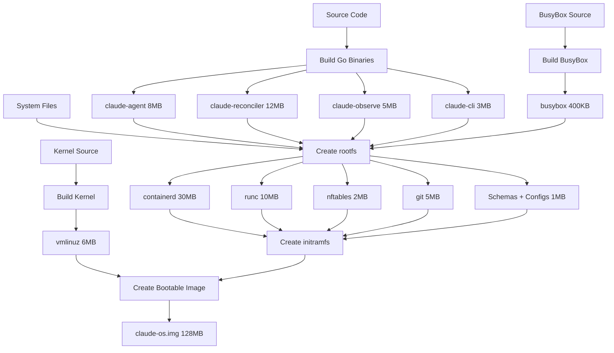

# Claude.OS: The LLM-Native Operating System

## Description

Claude.OS is a minimal Linux distribution designed from the ground up for AI-assisted system administration. Instead of learning complex commands, configuration syntax, and troubleshooting procedures, users describe their intent in natural language. An integrated LLM translates these requests into declarative state files, which a deterministic reconciliation engine applies to the system.

The core innovation is **separation of intelligence from execution**: the LLM reasons about what should happen and generates configuration, but never directly executes commands. A predictable, auditable reconciler handles all system modifications. This provides the flexibility of natural language with the safety of declarative infrastructure.

**Target Size:** 128MB base image (fits on minimal hardware, Raspberry Pi, edge devices)
**Target Platform:** x86_64 and aarch64, boots on bare metal, VMs, and containers
**Primary Interface:** Natural language conversation via CLI, SSH, or web UI

---

## Functionality

### Core Capabilities

1. **Natural Language System Administration**
   - User describes desired state in plain English
   - LLM translates to declarative YAML configuration
   - System converges to desired state automatically

2. **Declarative State Management**
   - All system configuration stored in `/etc/claude.d/`
   - Git-backed for history, rollback, and collaboration
   - Schema-validated before application

3. **Automatic Reconciliation**
   - Watches for state file changes
   - Computes diff between desired and actual state
   - Applies changes atomically with automatic rollback

4. **Conversational Debugging**
   - LLM has access to system metrics, logs, and events
   - Can diagnose problems and propose fixes
   - Explains issues in plain language

5. **Container-Native Workloads**
   - All applications run as OCI containers
   - No package management on host
   - Immutable base system

### User Interaction Modes

```
┌─────────────────────────────────────────────────────────────┐
│                    Interaction Modes                         │
├─────────────────────────────────────────────────────────────┤
│                                                             │
│  1. CLI Mode (default)                                      │
│     $ claude "set up a web server with nginx"               │
│     $ claude status                                         │
│     $ claude "why is the database slow?"                    │
│                                                             │
│  2. Interactive Mode                                        │
│     $ claude                                                │
│     claude> I need a PostgreSQL database                    │
│     claude> with daily backups to S3                        │
│     claude> and a connection limit of 100                   │
│                                                             │
│  3. SSH Mode (remote administration)                        │
│     $ ssh admin@server claude "check system health"         │
│                                                             │
│  4. Web UI Mode (optional)                                  │
│     Browser-based chat interface with visual dashboard      │
│                                                             │
│  5. API Mode (automation)                                   │
│     POST /api/v1/conversation                               │
│     {"message": "scale web servers to 3 replicas"}          │
│                                                             │
└─────────────────────────────────────────────────────────────┘
```

### Example Conversations

**Example 1: Setting Up Services**

```
User: I need a web application stack with nginx, PostgreSQL, and Redis

Claude.OS: I'll set up a complete web stack for you. Here's what I'm planning:

┌─────────────────────────────────────────────────────────────┐
│ Proposed Changes                                            │
├─────────────────────────────────────────────────────────────┤
│ + nginx:alpine        → port 80, 443                       │
│ + postgres:16-alpine  → port 5432, volume /data/postgres   │
│ + redis:7-alpine      → port 6379, volume /data/redis      │
│                                                             │
│ Storage: 3 persistent volumes will be created              │
│ Network: Internal network 'webstack' for service discovery │
└─────────────────────────────────────────────────────────────┘

Apply these changes? [yes/no/modify]

User: yes

Claude.OS: ✓ Created network 'webstack'
           ✓ Created volume 'postgres-data'
           ✓ Created volume 'redis-data'  
           ✓ Started postgres (healthy)
           ✓ Started redis (healthy)
           ✓ Started nginx (healthy)
           
           Your web stack is running. Access nginx at http://192.168.1.100
           PostgreSQL is available at localhost:5432
           Redis is available at localhost:6379
           
           Shall I configure SSL certificates?
```

**Example 2: Troubleshooting**

```
User: the website is down

Claude.OS: Let me investigate...

           Checking nginx... ✗ Container exited (exit code 1)
           
           Last 5 log lines:
           > nginx: [emerg] bind() to 0.0.0.0:80 failed (98: Address already in use)
           > nginx: [emerg] still could not bind()
           
           I found the problem: Another process is using port 80.
           
           Checking port 80... Found: apache2 (PID 1234) - this appears to be 
           an orphaned container from a previous configuration.

           Recommended fix:
           1. Stop the orphaned apache2 container
           2. Restart nginx
           
           Apply this fix? [yes/no/explain more]

User: yes

Claude.OS: ✓ Stopped orphaned container (apache2)
           ✓ Started nginx (healthy)
           ✓ Website is now accessible at http://192.168.1.100
           
           I've also added a cleanup rule to prevent orphaned containers
           in the future. Would you like me to explain what happened?
```

**Example 3: Security Configuration**

```
User: lock down the system, only allow SSH from 10.0.0.0/8

Claude.OS: I'll configure the firewall to restrict access. Here's the plan:

┌─────────────────────────────────────────────────────────────┐
│ Security Changes                                            │
├─────────────────────────────────────────────────────────────┤
│ Firewall:                                                   │
│   • Default policy: DROP (incoming)                        │
│   • Allow SSH (22) from 10.0.0.0/8 only                    │
│   • Allow established connections                          │
│   • Allow localhost                                         │
│                                                             │
│ ⚠ WARNING: This will block all other incoming traffic      │
│            including web (80, 443) and database ports      │
│                                                             │
│ Current connection from 10.0.1.50 will remain active       │
└─────────────────────────────────────────────────────────────┘

This is a significant security change. Proceed? [yes/no/modify]

User: also allow web traffic from anywhere

Claude.OS: Updated plan:

┌─────────────────────────────────────────────────────────────┐
│ Security Changes (revised)                                  │
├─────────────────────────────────────────────────────────────┤
│ Firewall:                                                   │
│   • Default policy: DROP (incoming)                        │
│   • Allow SSH (22) from 10.0.0.0/8 only                    │
│   • Allow HTTP (80) from anywhere                          │
│   • Allow HTTPS (443) from anywhere                        │
│   • Allow established connections                          │
│   • Allow localhost                                         │
└─────────────────────────────────────────────────────────────┘

Apply? [yes/no]

User: yes

Claude.OS: ✓ Firewall rules applied
           ✓ Verified SSH access from your IP (10.0.1.50)
           ✓ Verified web access
           ✓ Confirmed other ports are blocked
           
           Security configuration complete. Changes logged to audit.
```

---

## Technical Implementation

### System Architecture

```
┌─────────────────────────────────────────────────────────────────────────────┐
│                           Claude.OS Architecture                             │
├─────────────────────────────────────────────────────────────────────────────┤
│                                                                             │
│  ┌─────────────────────────────────────────────────────────────────────┐   │
│  │                        User Interface Layer                          │   │
│  │  ┌──────────┐  ┌──────────┐  ┌──────────┐  ┌──────────────────┐    │   │
│  │  │claude-cli│  │claude-web│  │   SSH    │  │   API Endpoint   │    │   │
│  │  └────┬─────┘  └────┬─────┘  └────┬─────┘  └────────┬─────────┘    │   │
│  │       └──────────────┴──────────────┴────────────────┘              │   │
│  └─────────────────────────────────┬───────────────────────────────────┘   │
│                                    │                                        │
│  ┌─────────────────────────────────▼───────────────────────────────────┐   │
│  │                        Intelligence Layer                            │   │
│  │  ┌─────────────────────────────────────────────────────────────┐    │   │
│  │  │                      claude-agent                            │    │   │
│  │  │  • Conversation management                                   │    │   │
│  │  │  • Context assembly (state + metrics + history)             │    │   │
│  │  │  • LLM API integration (Anthropic / local Llama)            │    │   │
│  │  │  • Response parsing and validation                          │    │   │
│  │  │  • State file generation                                    │    │   │
│  │  └─────────────────────────────────────────────────────────────┘    │   │
│  └─────────────────────────────────┬───────────────────────────────────┘   │
│                                    │                                        │
│  ┌─────────────────────────────────▼───────────────────────────────────┐   │
│  │                     Declarative State Layer                          │   │
│  │  ┌─────────────────────────────────────────────────────────────┐    │   │
│  │  │                   /etc/claude.d/ (git repo)                  │    │   │
│  │  │  ├── manifest.yaml      # System metadata                   │    │   │
│  │  │  ├── services.yaml      # Container workloads               │    │   │
│  │  │  ├── network.yaml       # Network configuration             │    │   │
│  │  │  ├── storage.yaml       # Volumes and mounts                │    │   │
│  │  │  ├── security.yaml      # Firewall, users, secrets          │    │   │
│  │  │  ├── scheduled.yaml     # Cron jobs and timers              │    │   │
│  │  │  └── .git/              # Version history                   │    │   │
│  │  └─────────────────────────────────────────────────────────────┘    │   │
│  └─────────────────────────────────┬───────────────────────────────────┘   │
│                                    │                                        │
│  ┌─────────────────────────────────▼───────────────────────────────────┐   │
│  │                      Reconciliation Layer                            │   │
│  │  ┌─────────────────────────────────────────────────────────────┐    │   │
│  │  │                    claude-reconciler                         │    │   │
│  │  │  • Watches state files (inotify)                            │    │   │
│  │  │  • Schema validation (JSON Schema)                          │    │   │
│  │  │  • Diff computation (desired vs actual)                     │    │   │
│  │  │  • Plan generation                                          │    │   │
│  │  │  • Atomic execution with rollback                           │    │   │
│  │  │  • Health verification                                      │    │   │
│  │  └─────────────────────────────────────────────────────────────┘    │   │
│  └─────────────────────────────────┬───────────────────────────────────┘   │
│                                    │                                        │
│  ┌─────────────────────────────────▼───────────────────────────────────┐   │
│  │                       Observation Layer                              │   │
│  │  ┌─────────────────────────────────────────────────────────────┐    │   │
│  │  │                     claude-observe                           │    │   │
│  │  │  • Container metrics (CPU, memory, network)                 │    │   │
│  │  │  • Log aggregation (ring buffer, last N lines)              │    │   │
│  │  │  • Event stream (starts, stops, crashes, config changes)    │    │   │
│  │  │  • Anomaly detection (crash loops, resource exhaustion)     │    │   │
│  │  │  • State summarization (for LLM context window)             │    │   │
│  │  └─────────────────────────────────────────────────────────────┘    │   │
│  └─────────────────────────────────┬───────────────────────────────────┘   │
│                                    │                                        │
│  ┌─────────────────────────────────▼───────────────────────────────────┐   │
│  │                         Execution Layer                              │   │
│  │  ┌────────────┐  ┌────────────┐  ┌────────────┐  ┌────────────┐    │   │
│  │  │ containerd │  │  nftables  │  │   systemd  │  │  dm-crypt  │    │   │
│  │  │ (runtime)  │  │ (firewall) │  │  (init)    │  │ (secrets)  │    │   │
│  │  └────────────┘  └────────────┘  └────────────┘  └────────────┘    │   │
│  └─────────────────────────────────────────────────────────────────────┘   │
│                                                                             │
│  ┌─────────────────────────────────────────────────────────────────────┐   │
│  │                          Base Layer                                  │   │
│  │  Linux Kernel 6.6 LTS │ musl libc │ BusyBox │ Immutable rootfs     │   │
│  └─────────────────────────────────────────────────────────────────────┘   │
│                                                                             │
└─────────────────────────────────────────────────────────────────────────────┘
```

### Component Specifications

#### Component: claude-agent

**Purpose:** Bridge between natural language and declarative state

**Language:** Go 1.21+

**Size Target:** 8MB static binary

**Responsibilities:**
1. Accept user input from CLI/web/API
2. Build LLM context from system state and conversation history
3. Send requests to LLM (Anthropic API or local model)
4. Parse LLM responses and extract state modifications
5. Validate proposed changes against schemas
6. Present plan to user for approval
7. Commit approved changes to git

**Context Assembly:**

```
┌─────────────────────────────────────────────────────────────────────────────┐
│                    LLM Context Window Structure                              │
├─────────────────────────────────────────────────────────────────────────────┤
│                                                                             │
│  SECTION 1: System Prompt (static, ~2000 tokens)                           │
│  ─────────────────────────────────────────────────────────                 │
│  You are Claude.OS, an AI assistant integrated into an operating system.   │
│  You help users manage their system through natural language.              │
│                                                                             │
│  Your capabilities:                                                         │
│  - Create and modify services (containers)                                 │
│  - Configure networking and firewalls                                      │
│  - Manage storage and backups                                              │
│  - Set up users and security                                               │
│  - Diagnose and fix problems                                               │
│                                                                             │
│  You NEVER execute commands directly. You generate YAML state files        │
│  that the reconciler applies. Always show the user what you plan to        │
│  change and ask for confirmation before modifying security.yaml.           │
│                                                                             │
│  Output format for changes:                                                 │
│  ```yaml:path/to/file.yaml                                                 │
│  <complete file contents>                                                  │
│  ```                                                                       │
│                                                                             │
│  SECTION 2: Schema Definitions (~3000 tokens)                              │
│  ─────────────────────────────────────────────────────────                 │
│  [JSON schemas for services.yaml, network.yaml, etc.]                      │
│                                                                             │
│  SECTION 3: Current State Summary (~1000 tokens, dynamic)                  │
│  ─────────────────────────────────────────────────────────                 │
│  Hostname: webserver-prod                                                   │
│  Uptime: 14 days                                                           │
│  IP: 192.168.1.100                                                         │
│                                                                             │
│  Running Services:                                                          │
│  - nginx:alpine (healthy, 15MB RAM, port 80,443)                          │
│  - postgres:16 (healthy, 256MB RAM, port 5432)                            │
│  - redis:7 (healthy, 50MB RAM, port 6379)                                 │
│                                                                             │
│  Resources:                                                                 │
│  - CPU: 12% (4 cores)                                                      │
│  - Memory: 1.2GB / 4GB (30%)                                               │
│  - Disk: 45GB / 100GB (45%)                                                │
│                                                                             │
│  Recent Events:                                                             │
│  - 10:15 nginx restarted (config reload)                                   │
│  - 09:30 backup completed (postgres, 2.3GB)                                │
│  - Yesterday certificate renewed (*.example.com)                           │
│                                                                             │
│  Alerts: None                                                               │
│                                                                             │
│  SECTION 4: Relevant State Files (~2000 tokens, on-demand)                 │
│  ─────────────────────────────────────────────────────────                 │
│  [Current services.yaml, network.yaml if user asks about them]             │
│                                                                             │
│  SECTION 5: Conversation History (~2000 tokens, sliding window)            │
│  ─────────────────────────────────────────────────────────                 │
│  User: Set up a web server                                                  │
│  Assistant: [created nginx service]                                         │
│  User: Add a database                                                       │
│  Assistant: [created postgres service]                                      │
│                                                                             │
│  SECTION 6: Current User Message                                           │
│  ─────────────────────────────────────────────────────────                 │
│  "Add caching with Redis"                                                  │
│                                                                             │
├─────────────────────────────────────────────────────────────────────────────┤
│  Total Context: ~10,000 tokens (fits in 16K context with room for output)  │
└─────────────────────────────────────────────────────────────────────────────┘
```

**LLM Response Parsing:**

The agent expects responses containing YAML blocks:

```
I'll add Redis as a caching layer. Here's the updated services configuration:

```yaml:services.yaml
apiVersion: claude.os/v1
kind: ServiceManifest
metadata:
  name: webstack
spec:
  services:
    # ... existing services ...
    - name: redis
      image: redis:7-alpine
      ports:
        - host: 6379
          container: 6379
      volumes:
        - source: /data/redis
          target: /data
      resources:
        memory: 256Mi
      healthcheck:
        test: "redis-cli ping"
```

This will:
1. Pull the redis:7-alpine image
2. Create a persistent volume at /data/redis
3. Expose Redis on port 6379
4. Set a memory limit of 256MB

Apply this change? [yes/no]
```

The agent:
1. Extracts content between ```yaml:filename and ```
2. Validates against JSON schema for that file type
3. Shows diff to user
4. On approval, writes to `/etc/claude.d/` and commits

---

#### Component: claude-reconciler

**Purpose:** Apply declarative state to the system

**Language:** Go 1.21+

**Size Target:** 12MB static binary

**Daemon:** Runs as systemd service, PID file at `/run/claude-reconciler.pid`

**Responsibilities:**
1. Watch `/etc/claude.d/` for file changes (inotify)
2. Validate all YAML files against JSON schemas
3. Build desired state model from all state files
4. Query actual state from system (containers, network, storage)
5. Compute diff (creates, updates, deletes)
6. Generate execution plan
7. Create pre-change snapshot for rollback
8. Execute plan steps atomically
9. Verify health after each step
10. Rollback on failure
11. Report results to observation layer

**Reconciliation Algorithm:**

```
┌─────────────────────────────────────────────────────────────────────────────┐
│                        Reconciliation Loop                                   │
├─────────────────────────────────────────────────────────────────────────────┤
│                                                                             │
│  1. WATCH                                                                   │
│     ┌─────────────────────────────────────────────────────────────────┐    │
│     │  inotify on /etc/claude.d/*.yaml                                │    │
│     │  Debounce: Wait 500ms after last change before processing       │    │
│     │  Trigger: IN_CLOSE_WRITE, IN_MOVED_TO, IN_DELETE                │    │
│     └─────────────────────────────────────────────────────────────────┘    │
│                                    │                                        │
│                                    ▼                                        │
│  2. VALIDATE                                                                │
│     ┌─────────────────────────────────────────────────────────────────┐    │
│     │  For each changed file:                                         │    │
│     │    - Parse YAML                                                 │    │
│     │    - Validate against JSON Schema                               │    │
│     │    - Check cross-file references (e.g., secrets exist)         │    │
│     │  If validation fails:                                           │    │
│     │    - Log error                                                  │    │
│     │    - Send notification                                          │    │
│     │    - DO NOT proceed                                             │    │
│     └─────────────────────────────────────────────────────────────────┘    │
│                                    │                                        │
│                                    ▼                                        │
│  3. COMPUTE DIFF                                                            │
│     ┌─────────────────────────────────────────────────────────────────┐    │
│     │  Desired State          Actual State                            │    │
│     │  (from YAML files)      (from system queries)                   │    │
│     │        │                       │                                │    │
│     │        └───────────┬───────────┘                                │    │
│     │                    │                                            │    │
│     │               Diff Engine                                       │    │
│     │                    │                                            │    │
│     │        ┌───────────┼───────────┐                                │    │
│     │        ▼           ▼           ▼                                │    │
│     │    Creates     Updates     Deletes                              │    │
│     └─────────────────────────────────────────────────────────────────┘    │
│                                    │                                        │
│                                    ▼                                        │
│  4. PLAN                                                                    │
│     ┌─────────────────────────────────────────────────────────────────┐    │
│     │  Generate ordered steps respecting dependencies:                │    │
│     │  1. Create networks (containers need them)                      │    │
│     │  2. Create volumes (containers mount them)                      │    │
│     │  3. Pull images (before starting containers)                    │    │
│     │  4. Stop containers being updated/deleted                       │    │
│     │  5. Update firewall rules                                       │    │
│     │  6. Start/update containers                                     │    │
│     │  7. Cleanup orphaned resources                                  │    │
│     └─────────────────────────────────────────────────────────────────┘    │
│                                    │                                        │
│                                    ▼                                        │
│  5. SNAPSHOT                                                                │
│     ┌─────────────────────────────────────────────────────────────────┐    │
│     │  Create rollback point:                                         │    │
│     │  - Record current container states                              │    │
│     │  - Copy current firewall rules                                  │    │
│     │  - Git commit hash as reference                                 │    │
│     │  Store in /var/lib/claude/snapshots/                            │    │
│     └─────────────────────────────────────────────────────────────────┘    │
│                                    │                                        │
│                                    ▼                                        │
│  6. EXECUTE                                                                 │
│     ┌─────────────────────────────────────────────────────────────────┐    │
│     │  For each step in plan:                                         │    │
│     │    - Execute step                                               │    │
│     │    - Wait for completion (with timeout)                         │    │
│     │    - Verify health check passes                                 │    │
│     │    - If failure:                                                │    │
│     │        - Rollback all changes                                   │    │
│     │        - Restore from snapshot                                  │    │
│     │        - Emit failure event                                     │    │
│     │        - EXIT                                                   │    │
│     └─────────────────────────────────────────────────────────────────┘    │
│                                    │                                        │
│                                    ▼                                        │
│  7. VERIFY                                                                  │
│     ┌─────────────────────────────────────────────────────────────────┐    │
│     │  Post-apply verification:                                       │    │
│     │  - All containers healthy                                       │    │
│     │  - Network connectivity test                                    │    │
│     │  - Firewall rules applied                                       │    │
│     │  - Storage mounts accessible                                    │    │
│     └─────────────────────────────────────────────────────────────────┘    │
│                                    │                                        │
│                                    ▼                                        │
│  8. REPORT                                                                  │
│     ┌─────────────────────────────────────────────────────────────────┐    │
│     │  Emit events to observation layer:                              │    │
│     │  - reconcile.started {timestamp, trigger}                       │    │
│     │  - reconcile.step {step_name, status, duration}                 │    │
│     │  - reconcile.completed {success, changes_count, duration}       │    │
│     │  - reconcile.failed {error, rolled_back}                        │    │
│     └─────────────────────────────────────────────────────────────────┘    │
│                                                                             │
└─────────────────────────────────────────────────────────────────────────────┘
```

---

#### Component: claude-observe

**Purpose:** Collect and summarize system state for LLM context

**Language:** Go 1.21+

**Size Target:** 5MB static binary

**Daemon:** Runs as systemd service

**Responsibilities:**
1. Collect container metrics via containerd API
2. Aggregate logs (ring buffer, configurable retention)
3. Track events (starts, stops, crashes, config changes)
4. Detect anomalies (crash loops, resource exhaustion, certificate expiry)
5. Generate state summaries for LLM context
6. Expose metrics for external monitoring (optional Prometheus endpoint)

**Data Retention:**
- Metrics: 1 hour at 10-second resolution, 24 hours at 1-minute resolution
- Logs: Last 1000 lines per service
- Events: Last 100 events, plus all events from last 24 hours

**State Summary Format:**

```yaml
# Generated by claude-observe, refreshed every 30 seconds
generated_at: "2025-01-11T10:30:00Z"

system:
  hostname: webserver-prod
  uptime: "14d 3h 22m"
  boot_time: "2024-12-28T07:08:00Z"
  
network:
  primary_ip: "192.168.1.100"
  interfaces:
    - name: eth0
      ip: "192.168.1.100/24"
      state: up
  dns_servers: ["8.8.8.8", "8.8.4.4"]
  
resources:
  cpu:
    cores: 4
    usage_percent: 12
  memory:
    total_mb: 4096
    used_mb: 1228
    usage_percent: 30
  disk:
    - mount: /
      total_gb: 100
      used_gb: 45
      usage_percent: 45

services:
  - name: nginx
    image: nginx:alpine
    state: running
    health: healthy
    uptime: "14d 2h"
    cpu_percent: 2
    memory_mb: 15
    ports: [80, 443]
    
  - name: postgres
    image: postgres:16-alpine
    state: running
    health: healthy
    uptime: "14d 2h"
    cpu_percent: 5
    memory_mb: 256
    ports: [5432]
    
  - name: redis
    image: redis:7-alpine
    state: running
    health: healthy
    uptime: "2d 5h"
    cpu_percent: 1
    memory_mb: 50
    ports: [6379]

recent_events:
  - time: "10:15"
    type: service.restarted
    service: nginx
    reason: config reload
    
  - time: "09:30"
    type: backup.completed
    service: postgres
    size: "2.3GB"
    
  - time: "yesterday"
    type: certificate.renewed
    domain: "*.example.com"
    expires: "2025-04-11"

alerts:
  - severity: warning
    message: "Certificate expires in 90 days"
    
anomalies: []

log_snippets:
  nginx:
    - "[notice] start worker process 42"
    - "[notice] start worker process 43"
  postgres:
    - "LOG: checkpoint complete"
```

---

#### Component: claude-cli

**Purpose:** Command-line interface for user interaction

**Language:** Go 1.21+

**Size Target:** 3MB static binary

**Commands:**

```
claude                      Interactive conversation mode
claude "<message>"          Single message mode
claude status              Show current system state summary
claude services            List running services
claude logs <service>      Show logs for a service
claude events              Show recent events
claude history             Show conversation history
claude rollback [commit]   Rollback to previous state
claude diff                Show pending changes
claude apply               Apply pending changes
claude validate            Validate state files
claude export              Export state files as tarball
claude import <file>       Import state files from tarball
claude help                Show help
```

**Interactive Mode Example:**

```
$ claude
Claude.OS v1.0.0 - Type 'exit' to quit, 'help' for commands

System: webserver-prod | 3 services running | No alerts

claude> what services are running?

Currently running 3 services:

┌─────────────────────────────────────────────────────────────┐
│ Service    │ Image           │ Status  │ Memory │ Ports    │
├────────────┼─────────────────┼─────────┼────────┼──────────┤
│ nginx      │ nginx:alpine    │ healthy │ 15MB   │ 80, 443  │
│ postgres   │ postgres:16     │ healthy │ 256MB  │ 5432     │
│ redis      │ redis:7-alpine  │ healthy │ 50MB   │ 6379     │
└─────────────────────────────────────────────────────────────┘

claude> add a monitoring stack with prometheus and grafana

I'll set up a monitoring stack. Here's the plan:

+ prometheus:latest    → port 9090, scrape all services
+ grafana:latest       → port 3000, dashboards

New storage:
+ /data/prometheus (10GB)
+ /data/grafana (1GB)

This will use approximately 500MB additional memory.

Apply? [yes/no/modify]

claude> yes

✓ Created prometheus volume
✓ Created grafana volume
✓ Started prometheus (healthy)
✓ Started grafana (healthy)

Monitoring stack is ready:
- Prometheus: http://192.168.1.100:9090
- Grafana: http://192.168.1.100:3000 (admin/admin)

Would you like me to configure Prometheus to scrape your existing services?

claude> yes please

✓ Added scrape targets: nginx, postgres, redis
✓ Prometheus config reloaded

Metrics are now being collected. You can view them in Grafana.

claude> exit
Goodbye!
```

---

### Data Models

#### State File: manifest.yaml

```yaml
# /etc/claude.d/manifest.yaml
# System-wide configuration

apiVersion: claude.os/v1
kind: SystemManifest
metadata:
  name: webserver-prod
  created: "2025-01-01T00:00:00Z"
  modified: "2025-01-11T10:30:00Z"

spec:
  # System identity
  hostname: webserver-prod
  timezone: America/Los_Angeles
  
  # LLM configuration
  llm:
    provider: anthropic          # anthropic | openai | local
    model: claude-sonnet-4-20250514
    api_key_secret: llm_api_key  # Reference to secrets
    max_tokens: 4096
    temperature: 0.3
    
    # For local models
    # provider: local
    # model_path: /var/lib/claude/models/llama-7b.gguf
    # context_size: 4096
    
  # Safety settings
  safety:
    require_approval: true           # Always ask before applying
    auto_approve_categories:         # Categories that don't need approval
      - service.restart
      - log.view
    restricted_files:                # Always require explicit approval
      - security.yaml
    max_changes_per_hour: 20         # Rate limit
    rollback_on_health_failure: true
    
  # Observation settings
  observe:
    metrics_retention: 24h
    log_lines_per_service: 1000
    event_retention: 100
    anomaly_detection: true
    
  # Backup settings
  backup:
    enabled: true
    schedule: "0 2 * * *"            # 2 AM daily
    retain: 7
    destination: /backup/claude
```

#### State File: services.yaml

```yaml
# /etc/claude.d/services.yaml
# Container service definitions

apiVersion: claude.os/v1
kind: ServiceManifest
metadata:
  name: webstack
  description: "Web application stack with database and caching"
  labels:
    environment: production
    team: platform

spec:
  # Network for service discovery
  networks:
    - name: webstack
      driver: bridge
      internal: false
      
  services:
    - name: nginx
      image: nginx:alpine
      tag: "1.25"
      
      ports:
        - host: 80
          container: 80
          protocol: tcp
        - host: 443
          container: 443
          protocol: tcp
          
      volumes:
        - source: /data/www
          target: /usr/share/nginx/html
          readonly: true
        - source: /data/nginx/conf.d
          target: /etc/nginx/conf.d
          readonly: true
        - source: /data/certs
          target: /etc/nginx/certs
          readonly: true
          
      environment:
        NGINX_WORKER_PROCESSES: "auto"
        
      resources:
        cpu: "0.5"
        memory: 128Mi
        
      healthcheck:
        test: "curl -f http://localhost/ || exit 1"
        interval: 30s
        timeout: 10s
        retries: 3
        start_period: 10s
        
      restart: always
      
      networks:
        - webstack
        
      depends_on: []
      
      labels:
        prometheus.scrape: "true"
        prometheus.port: "80"
        
    - name: postgres
      image: postgres
      tag: "16-alpine"
      
      ports:
        - host: 5432
          container: 5432
          
      volumes:
        - source: /data/postgres
          target: /var/lib/postgresql/data
          
      environment:
        POSTGRES_DB: app
        POSTGRES_USER: app
        POSTGRES_PASSWORD: ${secrets.postgres_password}
        
      resources:
        cpu: "1"
        memory: 512Mi
        
      healthcheck:
        test: "pg_isready -U app"
        interval: 30s
        timeout: 10s
        retries: 3
        
      restart: always
      networks:
        - webstack
        
      labels:
        prometheus.scrape: "true"
        prometheus.port: "9187"
        backup.enabled: "true"
        backup.schedule: "0 * * * *"
        
    - name: redis
      image: redis
      tag: "7-alpine"
      
      ports:
        - host: 6379
          container: 6379
          
      volumes:
        - source: /data/redis
          target: /data
          
      command: ["redis-server", "--appendonly", "yes"]
      
      resources:
        cpu: "0.25"
        memory: 256Mi
        
      healthcheck:
        test: "redis-cli ping"
        interval: 30s
        timeout: 10s
        retries: 3
        
      restart: always
      networks:
        - webstack
```

#### State File: network.yaml

```yaml
# /etc/claude.d/network.yaml
# Network configuration

apiVersion: claude.os/v1
kind: NetworkConfig
metadata:
  name: network
  
spec:
  hostname: webserver-prod
  
  interfaces:
    - name: eth0
      type: dhcp
      # For static:
      # type: static
      # address: 192.168.1.100/24
      # gateway: 192.168.1.1
      # dns:
      #   - 8.8.8.8
      #   - 8.8.4.4
      
  dns:
    nameservers:
      - 8.8.8.8
      - 8.8.4.4
    search:
      - example.com
      
  firewall:
    enabled: true
    default_input_policy: drop
    default_output_policy: accept
    default_forward_policy: drop
    
    rules:
      - name: allow-ssh-internal
        direction: input
        protocol: tcp
        port: 22
        source: 10.0.0.0/8
        action: accept
        
      - name: allow-http
        direction: input
        protocol: tcp
        port: 80
        source: 0.0.0.0/0
        action: accept
        
      - name: allow-https
        direction: input
        protocol: tcp
        port: 443
        source: 0.0.0.0/0
        action: accept
        
      - name: allow-established
        direction: input
        protocol: all
        state: established,related
        action: accept
        
      - name: allow-loopback
        direction: input
        interface: lo
        action: accept
```

#### State File: storage.yaml

```yaml
# /etc/claude.d/storage.yaml
# Storage configuration

apiVersion: claude.os/v1
kind: StorageConfig
metadata:
  name: storage

spec:
  volumes:
    - name: www
      path: /data/www
      size: 10Gi
      filesystem: ext4
      
    - name: postgres
      path: /data/postgres
      size: 50Gi
      filesystem: ext4
      backup:
        enabled: true
        schedule: "0 * * * *"    # Hourly
        retain: 24
        type: snapshot
        
    - name: redis
      path: /data/redis
      size: 5Gi
      filesystem: ext4
      
    - name: certs
      path: /data/certs
      size: 100Mi
      filesystem: ext4
      permissions: "0700"
      
  mounts:
    - source: /dev/sdb1
      target: /data
      type: ext4
      options:
        - defaults
        - noatime
```

#### State File: security.yaml

```yaml
# /etc/claude.d/security.yaml
# Security configuration - RESTRICTED
# Modifications always require explicit approval

apiVersion: claude.os/v1
kind: SecurityConfig
metadata:
  name: security

spec:
  users:
    - name: admin
      uid: 1000
      groups:
        - wheel
        - docker
      ssh_keys:
        - "ssh-ed25519 AAAA... admin@workstation"
      shell: /bin/sh
      
    - name: deploy
      uid: 1001
      groups:
        - docker
      ssh_keys:
        - "ssh-ed25519 AAAA... deploy@ci"
      shell: /bin/sh
      
  secrets:
    - name: postgres_password
      value: encrypted:v1:AAAA...  # Encrypted at rest
      
    - name: llm_api_key
      value: encrypted:v1:BBBB...
      
    - name: redis_password
      value: encrypted:v1:CCCC...
      
  certificates:
    - name: wildcard
      domains:
        - "*.example.com"
        - "example.com"
      provider: letsencrypt
      email: admin@example.com
      auto_renew: true
      renew_before_days: 30
      
  audit:
    enabled: true
    log_path: /var/log/claude/audit.log
    retention_days: 90
    log_events:
      - state.changed
      - service.started
      - service.stopped
      - security.modified
      - user.login
      - user.sudo
```

#### State File: scheduled.yaml

```yaml
# /etc/claude.d/scheduled.yaml
# Scheduled tasks

apiVersion: claude.os/v1
kind: ScheduledTasks
metadata:
  name: scheduled

spec:
  jobs:
    - name: postgres-backup
      schedule: "0 2 * * *"     # 2 AM daily
      container: postgres
      command: "pg_dump -U app app | gzip > /backup/db-$(date +%Y%m%d).sql.gz"
      timeout: 1h
      on_failure: notify
      
    - name: cleanup-logs
      schedule: "0 3 * * 0"     # 3 AM Sundays
      command: "find /var/log -name '*.log' -mtime +30 -delete"
      timeout: 10m
      
    - name: certificate-check
      schedule: "0 9 * * *"     # 9 AM daily
      command: "claude-check-certs"
      timeout: 5m
      on_failure: alert
      
    - name: security-updates
      schedule: "0 4 * * *"     # 4 AM daily
      command: "claude-check-updates"
      timeout: 30m
      on_success: notify
```

---

### Project Structure

```
claude-os/
├── cmd/
│   ├── claude-agent/
│   │   └── main.go              # LLM integration daemon
│   ├── claude-reconciler/
│   │   └── main.go              # State reconciliation daemon
│   ├── claude-observe/
│   │   └── main.go              # Observation daemon
│   └── claude-cli/
│       └── main.go              # CLI tool
│
├── pkg/
│   ├── agent/
│   │   ├── agent.go             # Main agent logic
│   │   ├── context.go           # Context assembly
│   │   ├── llm.go               # LLM API client
│   │   ├── parser.go            # Response parser
│   │   └── conversation.go      # History management
│   │
│   ├── reconciler/
│   │   ├── reconciler.go        # Main reconciler logic
│   │   ├── watcher.go           # File watcher
│   │   ├── validator.go         # Schema validation
│   │   ├── differ.go            # State diff computation
│   │   ├── planner.go           # Plan generation
│   │   ├── executor.go          # Plan execution
│   │   └── rollback.go          # Rollback logic
│   │
│   ├── observe/
│   │   ├── observe.go           # Main observer logic
│   │   ├── metrics.go           # Metrics collection
│   │   ├── logs.go              # Log aggregation
│   │   ├── events.go            # Event tracking
│   │   ├── anomaly.go           # Anomaly detection
│   │   └── summary.go           # State summarization
│   │
│   ├── state/
│   │   ├── types.go             # State data structures
│   │   ├── parser.go            # YAML parser
│   │   ├── git.go               # Git operations
│   │   └── secrets.go           # Secret encryption/decryption
│   │
│   ├── executor/
│   │   ├── container.go         # containerd operations
│   │   ├── network.go           # Network configuration
│   │   ├── firewall.go          # nftables operations
│   │   ├── storage.go           # Volume management
│   │   └── user.go              # User management
│   │
│   └── schemas/
│       ├── manifest.json
│       ├── services.json
│       ├── network.json
│       ├── storage.json
│       ├── security.json
│       └── scheduled.json
│
├── configs/
│   ├── kernel.config            # Minimal kernel config
│   ├── busybox.config           # BusyBox config
│   └── system-prompt.md         # LLM system prompt
│
├── rootfs/
│   ├── etc/
│   │   ├── claude.d/            # Default state files
│   │   │   ├── manifest.yaml
│   │   │   └── .gitkeep
│   │   └── systemd/
│   │       └── system/
│   │           ├── claude-agent.service
│   │           ├── claude-reconciler.service
│   │           └── claude-observe.service
│   └── usr/
│       └── share/
│           └── claude/
│               └── schemas/     # JSON schemas
│
├── scripts/
│   ├── build.sh                 # Master build script
│   ├── build-kernel.sh
│   ├── build-userspace.sh
│   ├── build-tools.sh
│   └── create-image.sh
│
├── docs/
│   ├── architecture.md
│   ├── state-files.md
│   ├── llm-integration.md
│   └── operations.md
│
├── Makefile
├── go.mod
├── go.sum
└── README.md
```

---

### Build Pipeline



---

## Testing Scenarios

### Test 1: Fresh Boot and Initial Setup

```bash
# Boot Claude.OS in QEMU
qemu-system-x86_64 -m 2G -hda claude-os.img -nographic

# Expected output:
# Claude.OS v1.0.0
# Hostname: claude-os
# IP: (DHCP assigned)
# Services: 0 running
# 
# Type 'claude' to start, or 'claude help' for commands

# Run initial setup
claude "set up a basic web server"

# Expected:
# - LLM proposes nginx service
# - User approves
# - nginx container started
# - Health check passes
```

### Test 2: Multi-Service Stack

```bash
claude "I need a complete web application stack: nginx for frontend, PostgreSQL for database, Redis for caching, and set up automatic daily backups"

# Expected:
# - LLM proposes 3 services with appropriate configuration
# - Creates persistent volumes
# - Configures backup schedule
# - Sets up service networking
# - All services start and pass health checks
```

### Test 3: Troubleshooting Flow

```bash
# Intentionally break something
docker stop nginx

# User reports issue
claude "the website is down"

# Expected:
# - LLM queries observation layer
# - Identifies nginx is stopped
# - Explains the issue
# - Proposes restart
# - After approval, restarts nginx
# - Verifies fix worked
```

### Test 4: Security Configuration

```bash
claude "lock down SSH to only allow connections from 10.0.0.0/8 and enable fail2ban"

# Expected:
# - LLM recognizes security-sensitive change
# - Shows detailed plan with warnings
# - Requires explicit confirmation
# - Modifies security.yaml
# - Reconciler applies firewall rules
# - Verifies current connection still works before fully applying
```

### Test 5: Rollback

```bash
# Make a breaking change
claude "stop all services"

# After approval, all services stop

# Rollback
claude rollback

# Expected:
# - Shows list of recent changes
# - User selects rollback point
# - Git reverts to previous commit
# - Reconciler restores previous state
# - Services restart
```

### Test 6: Validation Failure

```bash
# Manually corrupt a state file
echo "invalid: yaml: {{{{" >> /etc/claude.d/services.yaml

# Expected:
# - Reconciler detects change
# - Schema validation fails
# - Error logged
# - Notification sent to user
# - No changes applied
# - System remains stable
```

### Test 7: Health Check Failure and Auto-Rollback

```bash
# Configure a service that will fail
claude "add a service called 'broken' using image 'nonexistent:latest'"

# Expected:
# - LLM creates service definition
# - Reconciler tries to pull image
# - Pull fails
# - Automatic rollback triggered
# - Error reported to user
# - Previous state preserved
```

### Test 8: Concurrent Modification

```bash
# In terminal 1:
claude "add prometheus monitoring"

# In terminal 2 (before terminal 1 completes):
claude "add grafana dashboards"

# Expected:
# - Both requests handled sequentially (locking)
# - Both changes applied correctly
# - No race conditions
# - Git history shows both commits
```

---

## Performance Goals

| Metric | Target | Maximum |
|--------|--------|---------|
| Boot to shell | 5s | 10s |
| LLM response time | 3s | 10s |
| Reconciliation (single service) | 5s | 15s |
| Reconciliation (full stack) | 30s | 60s |
| Memory (idle) | 256MB | 512MB |
| Memory (active) | 512MB | 1GB |
| Disk (base image) | 128MB | 200MB |
| State file parse time | 10ms | 100ms |
| Context assembly time | 100ms | 500ms |

---

## Security Model

### Principle: LLM Never Executes Directly

```
┌─────────────────────────────────────────────────────────────────────────────┐
│                         Security Architecture                                │
├─────────────────────────────────────────────────────────────────────────────┤
│                                                                             │
│  UNTRUSTED                    TRUSTED BOUNDARY                 TRUSTED      │
│  ──────────                   ───────────────                 ─────────     │
│                                      │                                      │
│  ┌─────────────┐                     │                    ┌─────────────┐  │
│  │   User      │                     │                    │   System    │  │
│  │   Input     │                     │                    │  Resources  │  │
│  └──────┬──────┘                     │                    └──────▲──────┘  │
│         │                            │                           │         │
│         ▼                            │                           │         │
│  ┌─────────────┐                     │                    ┌──────┴──────┐  │
│  │    LLM      │                     │                    │ Reconciler  │  │
│  │  (Remote)   │ ────generates────▶  │  ────validates───▶ │ (Local)     │  │
│  └─────────────┘      YAML           │       Schema       └─────────────┘  │
│                                      │                                      │
│  LLM can ONLY:                       │    Reconciler can ONLY:             │
│  • Read state summaries              │    • Apply valid YAML               │
│  • Generate YAML files               │    • Execute predefined ops         │
│  • Propose changes                   │    • Rollback on failure            │
│                                      │                                      │
│  LLM CANNOT:                         │    Reconciler verifies:             │
│  • Execute shell commands            │    • Schema compliance              │
│  • Access secrets directly           │    • Resource limits                │
│  • Bypass approval flow              │    • Security constraints           │
│  • Modify running containers         │    • Dependency order               │
│                                      │                                      │
└─────────────────────────────────────────────────────────────────────────────┘
```

### Safety Mechanisms

1. **Schema Validation**
   - Every state file validated against JSON schema
   - Invalid files rejected before processing
   - Prevents injection attacks

2. **Approval Flow**
   - All changes require user approval by default
   - Security changes require explicit confirmation
   - Rate limiting prevents rapid changes

3. **Automatic Rollback**
   - Pre-change snapshots always created
   - Health check failures trigger rollback
   - Git provides complete audit trail

4. **Capability Bounds**
   - Reconciler has limited, audited operations
   - No arbitrary command execution
   - Container isolation for workloads

5. **Secret Management**
   - Secrets encrypted at rest
   - Never exposed to LLM in plaintext
   - References via `${secrets.name}` syntax

6. **Audit Logging**
   - Every change logged with timestamp and user
   - Git history provides immutable record
   - Anomaly detection for unusual patterns

---

## Extended Features (Future)

### Phase 2: Cluster Mode

- Multiple Claude.OS nodes
- Distributed state (etcd or similar)
- Service placement across nodes
- Leader election for reconciliation

### Phase 3: Learning Mode

- Track successful/failed changes
- Learn user preferences
- Improve suggestions over time
- Anomaly detection improvements

### Phase 4: Marketplace

- Pre-built state templates
- Community-contributed configurations
- One-command stack deployments
- "claude install wordpress"

---

## Implementation Notes for Claude Code

1. **Start with reconciler** — It's the core. Build and test thoroughly before adding LLM integration.

2. **Use containerd directly** — Don't shell out to docker CLI. Use containerd Go client.

3. **Schema-first development** — Define JSON schemas first, generate Go types from them.

4. **Git operations** — Use go-git library, not shell commands.

5. **Secrets handling** — Use age encryption (or similar). Never store plaintext.

6. **Testing** — Unit tests for each component, integration tests with real containers.

7. **Build reproducibility** — Pin all dependencies, use Nix or similar for toolchain.

8. **LLM prompt engineering** — System prompt is critical. Include concrete examples.

9. **Error messages** — Every error should explain what went wrong AND how to fix it.

10. **Progressive disclosure** — Start simple (single service), add complexity incrementally.

---

*TINS README v1.0 — Claude.OS: The Operating System That Writes Itself*
*Sufficient for complete implementation generation by LLM*
