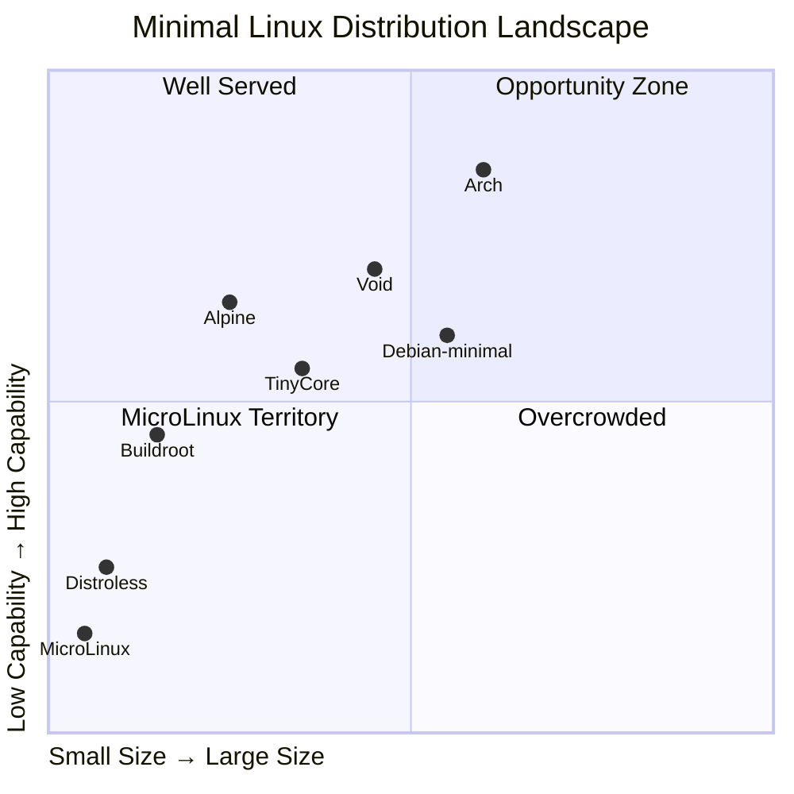

# MicroLinux Successor Study: Beyond the Floppy

## A Technical Exploration of Modern Minimal Linux Distributions

---

## Executive Summary

MicroLinux demonstrated that a functional Linux system can fit in 1.44MB. This study explores what becomes possible when we release that constraint, examining use cases from 16MB USB rescue systems to 1GB+ full-featured distributions. We propose a tiered family of successors—**NanoLinux**, **PicoStation**, **MicroOS**, and **StrataLinux**—each optimized for specific deployment scenarios.

The study finds that the most compelling opportunities lie in the 64-256MB range, where modern techniques (musl libc, Wayland, container runtimes) enable capabilities that would have required gigabytes a decade ago. We also identify significant potential for LLM-assisted distribution development, maintenance, and customization.

---

## Part 1: Constraint Analysis — What MicroLinux Sacrificed

### 1.1 Features Disabled for Size

| Category | What Was Cut | Size Cost | User Impact |
|----------|--------------|-----------|-------------|
| **Networking** | TCP/IP stack, drivers | ~150KB kernel | No network rescue, no SSH |
| **USB Support** | USB subsystem, storage | ~80KB kernel | Can't boot from USB, no USB drives |
| **Module Loading** | Dynamic modules | ~30KB + flexibility | Must rebuild kernel for hardware changes |
| **Filesystem Variety** | ext3/4, xfs, btrfs, ntfs | ~200KB kernel | Can't mount modern filesystems |
| **Compression Tools** | bzip2, lzma, zstd binaries | ~100KB userspace | Limited archive handling |
| **Text Utilities** | less, more, diff, patch | ~80KB userspace | Primitive file viewing/comparison |
| **Process Tools** | top, htop, strace, lsof | ~150KB userspace | Limited debugging capability |
| **Partition Tools** | parted, gdisk, LVM | ~300KB userspace | No GPT, no LVM rescue |
| **Network Tools** | curl, wget, ssh, rsync | ~500KB userspace | No file transfer capability |
| **Hardware Detection** | PCI enumeration, udev | ~200KB userspace | Manual device configuration |

### 1.2 Architectural Compromises

```
MicroLinux Limitations:
├── Single CPU only (no SMP)
├── No kernel preemption (poor responsiveness)
├── No memory protection features (ASLR, stack canaries)
├── No power management (drains battery)
├── No hotplug support (static hardware only)
├── No kernel security modules (no SELinux, AppArmor)
├── No audit subsystem (no logging infrastructure)
├── No cgroups/namespaces (no containers)
├── No real-time capabilities
└── No UEFI boot (BIOS only)
```

### 1.3 The Size/Capability Curve

```
Capability
    │
100%│                                          ●━━━━━━━━━━━━━
    │                                     ●━━━━
    │                                ●━━━━
    │                           ●━━━━
    │                      ●━━━━
    │                 ●━━━━
 50%│            ●━━━━
    │        ●━━━
    │     ●━━
    │   ●━
    │  ●
    │ ●  ← MicroLinux (1.44MB) ≈ 5% capability
  0%│●━━━━━━━━━━━━━━━━━━━━━━━━━━━━━━━━━━━━━━━━━━━━━
    └──┬───┬───┬───┬───┬───┬───┬───┬───┬───┬───→ Size
       1M  16M 64M 256M 512M 1G  2G  4G  8G  16G

Key inflection points:
• 16MB:   Networking becomes practical
• 64MB:   Container runtime feasible
• 256MB:  Graphical interface viable
• 1GB:    Full development environment
• 4GB:    Modern desktop experience
```

---

## Part 2: Use Case Analysis

### 2.1 Target Deployment Scenarios

| Scenario | Size Budget | Key Requirements | Current Solutions |
|----------|-------------|------------------|-------------------|
| **USB Rescue Drive** | 16-64MB | Boot anywhere, network, disk tools | SystemRescue, Finnix |
| **Embedded IoT** | 8-32MB | Headless, sensors, MQTT | Buildroot, Yocto |
| **Container Base** | 5-50MB | Minimal attack surface, fast pull | Alpine, Distroless |
| **Network Appliance** | 32-128MB | Routing, firewall, VPN | OpenWrt, VyOS |
| **Kiosk/Signage** | 128-512MB | Browser, display, remote mgmt | Porteus Kiosk |
| **Development VM** | 256MB-1GB | Compilers, git, containers | Alpine, Void |
| **Desktop Workstation** | 1-4GB | GUI, productivity apps, multimedia | Tiny Core, antiX |
| **Server Base** | 128-512MB | Containers, orchestration | Flatcar, Talos |
| **Live Security Audit** | 512MB-2GB | Pen testing tools, forensics | Kali, Parrot |
| **Scientific Computing** | 1-8GB | Numerical libraries, parallel | Custom Buildroot |

### 2.2 Gap Analysis — What's Missing in the Market



**Identified Gaps:**

1. **Modern Rescue System** (32-64MB)
   - Alpine is excellent but not rescue-focused
   - SystemRescue is bloated (800MB+)
   - Need: Optimized rescue with modern tools

2. **Container-Native Workstation** (256-512MB)
   - Run containers, not packages
   - Immutable base, container-delivered apps
   - Gap between Fedora Silverblue (2GB+) and nothing

3. **LLM-Optimized Development Environment** (128-256MB)
   - Minimal base for AI code generation
   - Optimized for Claude Code / Copilot workflows
   - Fast iteration, ephemeral environments

4. **Edge Computing Platform** (64-128MB)
   - Kubernetes-ready but tiny
   - OTA updates, secure boot
   - Between OpenWrt and Flatcar

---

## Part 3: Proposed Successor Tiers

### 3.1 Tier 1: NanoLinux (16MB)

**Mission:** Universal USB rescue system that boots on any x86 hardware

```
┌─────────────────────────────────────────────────────────────┐
│                     NanoLinux 16MB                          │
├─────────────────────────────────────────────────────────────┤
│ Kernel (6.6 LTS)                                    4.0 MB  │
│ ├── SMP support (multi-core)                                │
│ ├── Full filesystem suite (ext2/3/4, xfs, btrfs, ntfs-3g)  │
│ ├── USB mass storage                                        │
│ ├── NVMe support                                            │
│ ├── Full networking (IPv4/IPv6, WiFi basics)               │
│ └── Virtio drivers                                          │
├─────────────────────────────────────────────────────────────┤
│ Initramfs (compressed)                              10.0 MB  │
│ ├── BusyBox 1.36 (full applet set)           400 KB         │
│ ├── Dropbear SSH                             200 KB         │
│ ├── e2fsprogs (fsck.ext4)                    800 KB         │
│ ├── dosfstools                               100 KB         │
│ ├── ntfs-3g                                  600 KB         │
│ ├── parted + gdisk                           500 KB         │
│ ├── lvm2 tools                               400 KB         │
│ ├── mdadm                                    300 KB         │
│ ├── cryptsetup                               500 KB         │
│ ├── ddrescue                                 200 KB         │
│ ├── testdisk + photorec                    1,500 KB         │
│ ├── rsync                                    400 KB         │
│ ├── curl (with SSL)                          800 KB         │
│ ├── nvme-cli                                 300 KB         │
│ ├── smartmontools                            400 KB         │
│ ├── pv (pipe viewer)                         100 KB         │
│ └── tmux                                     400 KB         │
├─────────────────────────────────────────────────────────────┤
│ Boot (SYSLINUX + EFI stub)                          2.0 MB  │
└─────────────────────────────────────────────────────────────┤
                                                Total: 16.0 MB
```

**Key Capabilities:**
- ✅ Boot on BIOS and UEFI systems
- ✅ Mount and repair any Linux filesystem
- ✅ Read/write NTFS (Windows recovery)
- ✅ Network access (SSH in/out, HTTP transfers)
- ✅ RAID and LVM recovery
- ✅ Encrypted volume access
- ✅ Disk cloning and recovery
- ✅ S.M.A.R.T. diagnostics
- ✅ NVMe support (modern hardware)
- ✅ Multi-core utilization

**Build Approach:**
```bash
# Based on Buildroot with custom config
make BR2_EXTERNAL=nanolinux-tree qemu_x86_64_defconfig
make nanolinux_overlay
make -j$(nproc)
# Output: 16MB hybrid ISO (USB + CD bootable)
```

---

### 3.2 Tier 2: PicoStation (64MB)

**Mission:** Minimal container host for edge computing and CI/CD

```
┌─────────────────────────────────────────────────────────────┐
│                    PicoStation 64MB                         │
├─────────────────────────────────────────────────────────────┤
│ Kernel (6.6 LTS, hardened)                          6.0 MB  │
│ ├── Full cgroups v2                                         │
│ ├── Namespaces (all types)                                  │
│ ├── Seccomp-bpf                                             │
│ ├── OverlayFS                                               │
│ ├── VXLAN/WireGuard                                         │
│ ├── Netfilter/nftables                                      │
│ └── io_uring                                                │
├─────────────────────────────────────────────────────────────┤
│ Base System (musl-based)                           12.0 MB  │
│ ├── musl libc                                    600 KB     │
│ ├── BusyBox                                      400 KB     │
│ ├── OpenRC init                                  800 KB     │
│ ├── containerd                                 8,000 KB     │
│ ├── runc                                       2,000 KB     │
│ └── CNI plugins (basic)                        1,200 KB     │
├─────────────────────────────────────────────────────────────┤
│ Networking                                          8.0 MB  │
│ ├── iproute2                                   1,500 KB     │
│ ├── nftables                                     800 KB     │
│ ├── WireGuard tools                              200 KB     │
│ ├── chrony (NTP)                                 500 KB     │
│ └── flannel / Calico lite                      5,000 KB     │
├─────────────────────────────────────────────────────────────┤
│ Management                                          6.0 MB  │
│ ├── Dropbear SSH                                 200 KB     │
│ ├── curl                                         800 KB     │
│ ├── jq                                           300 KB     │
│ ├── nerdctl (Docker CLI compat)                3,500 KB     │
│ └── cloud-init (lite)                          1,200 KB     │
├─────────────────────────────────────────────────────────────┤
│ System                                             30.0 MB  │
│ ├── Firmware (minimal)                        20,000 KB     │
│ ├── CA certificates                              400 KB     │
│ ├── Timezone data                                500 KB     │
│ └── Kernel modules (compressed)                9,100 KB     │
├─────────────────────────────────────────────────────────────┤
│ Boot (systemd-boot)                                 2.0 MB  │
└─────────────────────────────────────────────────────────────┤
                                                Total: 64.0 MB
```

**Key Capabilities:**
- ✅ Run OCI containers (Docker images)
- ✅ Kubernetes node ready (k3s/k0s compatible)
- ✅ Secure by default (hardened kernel, minimal surface)
- ✅ Network boot + cloud-init
- ✅ WireGuard VPN built-in
- ✅ Immutable root filesystem (dm-verity optional)
- ✅ OTA updates via A/B partitioning
- ✅ Edge-friendly (runs on 256MB RAM)

**Architecture:**
```
┌─────────────────────────────────────────┐
│            PicoStation Host             │
├─────────────────────────────────────────┤
│  ┌─────────┐ ┌─────────┐ ┌─────────┐   │
│  │Container│ │Container│ │Container│   │
│  │  App A  │ │  App B  │ │  App C  │   │
│  └────┬────┘ └────┬────┘ └────┬────┘   │
│       └──────────┼──────────┘          │
│              containerd                 │
├─────────────────────────────────────────┤
│         Minimal musl userspace          │
├─────────────────────────────────────────┤
│         Hardened Linux Kernel           │
├─────────────────────────────────────────┤
│    dm-verity protected root (RO)        │
└─────────────────────────────────────────┘
```

**Comparison to Alternatives:**

| Feature | PicoStation | Alpine | Flatcar | Talos |
|---------|-------------|--------|---------|-------|
| Size | 64MB | 150MB | 400MB | 100MB |
| Container Runtime | containerd | containerd | containerd | containerd |
| Init System | OpenRC | OpenRC | systemd | custom |
| Package Manager | None | apk | None | None |
| Shell Access | Yes | Yes | Yes | No |
| Immutable Root | Optional | No | Yes | Yes |
| Kubernetes Ready | Yes | Manual | Yes | Yes |
| GUI Option | No | Yes | No | No |

---

### 3.3 Tier 3: MicroOS (256MB)

**Mission:** Graphical workstation for development and lightweight desktop use

```
┌─────────────────────────────────────────────────────────────┐
│                     MicroOS 256MB                           │
├─────────────────────────────────────────────────────────────┤
│ Kernel (6.6 LTS)                                    8.0 MB  │
│ ├── Full hardware support                                   │
│ ├── DRM/KMS graphics                                        │
│ ├── Sound (ALSA core)                                       │
│ └── Power management                                        │
├─────────────────────────────────────────────────────────────┤
│ Graphics Stack                                     40.0 MB  │
│ ├── Mesa (software + Intel/AMD)               25,000 KB     │
│ ├── Wayland compositor (cage/labwc)            5,000 KB     │
│ ├── XWayland (compatibility)                   8,000 KB     │
│ └── libinput                                   2,000 KB     │
├─────────────────────────────────────────────────────────────┤
│ Desktop Environment                                50.0 MB  │
│ ├── foot terminal                              1,000 KB     │
│ ├── fuzzel launcher                              500 KB     │
│ ├── mako notifications                           300 KB     │
│ ├── Firefox (ESR, stripped)                   45,000 KB     │
│ └── PCManFM-Qt (file manager)                  3,200 KB     │
├─────────────────────────────────────────────────────────────┤
│ Development Tools                                  60.0 MB  │
│ ├── GCC toolchain                             35,000 KB     │
│ ├── LLVM/Clang (stripped)                          0 KB     │  
│ ├── Git                                        8,000 KB     │
│ ├── Python 3.11 (minimal)                     12,000 KB     │
│ ├── Node.js (stripped)                             0 KB     │
│ ├── neovim                                     4,000 KB     │
│ └── tmux                                       1,000 KB     │
├─────────────────────────────────────────────────────────────┤
│ Containers & Virtualization                        20.0 MB  │
│ ├── containerd                                 8,000 KB     │
│ ├── nerdctl                                    3,500 KB     │
│ ├── QEMU (x86 only, stripped)                  8,500 KB     │
│ └── virtio-fs                                      0 KB     │
├─────────────────────────────────────────────────────────────┤
│ Base System                                        50.0 MB  │
│ ├── musl libc                                    600 KB     │
│ ├── BusyBox                                      500 KB     │
│ ├── OpenRC                                       800 KB     │
│ ├── eudev                                      1,500 KB     │
│ ├── dbus                                       1,200 KB     │
│ ├── Fonts (2 families)                        10,000 KB     │
│ ├── CA certs + tzdata                          1,000 KB     │
│ └── Firmware (GPU, WiFi)                      34,400 KB     │
├─────────────────────────────────────────────────────────────┤
│ Network & System Tools                             26.0 MB  │
│ ├── NetworkManager (lite)                      5,000 KB     │
│ ├── OpenSSH                                    2,000 KB     │
│ ├── curl + wget                                1,500 KB     │
│ ├── rsync                                        400 KB     │
│ └── System utilities                          17,100 KB     │
├─────────────────────────────────────────────────────────────┤
│ Boot                                                2.0 MB  │
└─────────────────────────────────────────────────────────────┤
                                               Total: 256.0 MB
```

**Desktop Experience:**
```
┌─────────────────────────────────────────────────────────────┐
│ ▸ Applications  │ MicroOS                        ─ □ ✕ │
├─────────────────┼───────────────────────────────────────────┤
│                 │ ┌─────────────────────────────────────┐   │
│  Files          │ │ user@micro:~$ neovim project/     │   │
│  Terminal       │ │                                     │   │
│  Browser        │ │ ~                                   │   │
│  Settings       │ │ ~  MicroOS Development Environment │   │
│                 │ │ ~  256MB · Wayland · musl          │   │
│                 │ │ ~                                   │   │
│                 │ │                                     │   │
│                 │ └─────────────────────────────────────┘   │
│                 │                                           │
│ ▾ Running       │  [foot]  [firefox]  [files]              │
└─────────────────┴───────────────────────────────────────────┘
```

**Key Capabilities:**
- ✅ Full graphical desktop (Wayland-native)
- ✅ Web browsing (Firefox ESR)
- ✅ Software development (C, Python)
- ✅ Container development workflow
- ✅ Git-based project management
- ✅ Runs in 512MB RAM
- ✅ Boots from USB in under 10 seconds
- ✅ WiFi and Ethernet networking

---

### 3.4 Tier 4: StrataLinux (1GB)

**Mission:** Full-featured immutable desktop with layered architecture

```
┌─────────────────────────────────────────────────────────────┐
│                    StrataLinux 1GB                          │
│              "Layers of Capability"                         │
├─────────────────────────────────────────────────────────────┤
│                                                             │
│   ┌─────────────────────────────────────────────────────┐   │
│   │              Application Layer (300MB)               │   │
│   │  LibreOffice · GIMP · VLC · VS Code · Chromium      │   │
│   │  (Delivered as Flatpaks or AppImages)                │   │
│   └─────────────────────────────────────────────────────┘   │
│                          ▲                                  │
│                    Flatpak Runtime                          │
│                          ▲                                  │
│   ┌─────────────────────────────────────────────────────┐   │
│   │              Desktop Layer (250MB)                   │   │
│   │  Sway/Hyprland · Waybar · GTK4 · Qt6 · PipeWire    │   │
│   └─────────────────────────────────────────────────────┘   │
│                          ▲                                  │
│                     OverlayFS                               │
│                          ▲                                  │
│   ┌─────────────────────────────────────────────────────┐   │
│   │              Platform Layer (300MB)                  │   │
│   │  systemd · NetworkManager · Podman · Toolbox        │   │
│   │  Full GNU coreutils · bash · zsh · Python · Rust    │   │
│   └─────────────────────────────────────────────────────┘   │
│                          ▲                                  │
│                     OverlayFS                               │
│                          ▲                                  │
│   ┌─────────────────────────────────────────────────────┐   │
│   │               Core Layer (150MB)                     │   │
│   │  Linux 6.6 · glibc · Mesa · Firmware · dm-verity    │   │
│   │  (Immutable, cryptographically verified)             │   │
│   └─────────────────────────────────────────────────────┘   │
│                                                             │
└─────────────────────────────────────────────────────────────┘
                                               Total: ~1000 MB
```

**Layered Update Model:**
```
Version 1.0                    Version 1.1
┌────────────┐                ┌────────────┐
│ App Layer  │ ──(unchanged)──▶ │ App Layer  │
├────────────┤                ├────────────┤
│Desktop 1.0 │ ──(updated)────▶ │Desktop 1.1 │ ← Only this downloads
├────────────┤                ├────────────┤
│Platform 1.0│ ──(unchanged)──▶ │Platform 1.0│
├────────────┤                ├────────────┤
│  Core 1.0  │ ──(unchanged)──▶ │  Core 1.0  │
└────────────┘                └────────────┘

Update size: ~50MB instead of full image
Rollback: Instant (just remount previous layer)
```

**Key Capabilities:**
- ✅ Full desktop productivity suite
- ✅ Immutable base with verified boot
- ✅ Atomic updates with instant rollback
- ✅ Flatpak ecosystem for applications
- ✅ Podman containers for development
- ✅ Toolbox for mutable development environments
- ✅ Runs on 2GB RAM comfortably
- ✅ Modern Wayland compositor (Sway or Hyprland)
- ✅ PipeWire audio (low-latency, Bluetooth)
- ✅ Full Rust/Python/Node development ready

---

## Part 4: Technical Deep Dives

### 4.1 Kernel Optimization Strategies

**Size vs. Capability Trade-offs:**

```
                    Kernel Size Analysis
┌─────────────────────────────────────────────────────────────┐
│ Configuration                          │ Size   │ Notes     │
├────────────────────────────────────────┼────────┼───────────┤
│ tinyconfig (absolute minimum)          │ 400KB  │ Won't boot│
│ + boot essentials                      │ 600KB  │ Serial only│
│ + VGA + keyboard                       │ 700KB  │ Basic boot │
│ + initramfs support                    │ 750KB  │ MicroLinux │
│ + ext4 + network                       │ 1.5MB  │ Useful     │
│ + USB + NVMe                           │ 2.0MB  │ Modern HW  │
│ + full fs suite                        │ 3.0MB  │ Rescue     │
│ + containers (cgroups, ns)             │ 4.0MB  │ Container  │
│ + DRM/KMS (no GPU)                     │ 5.0MB  │ Basic GUI  │
│ + Intel/AMD GPU                        │ 8.0MB  │ Full GUI   │
│ + sound + power + security             │ 12.0MB │ Desktop    │
│ defconfig (everything)                 │ 80.0MB │ Distro     │
└─────────────────────────────────────────────────────────────┘
```

**Recommended Kernel Profiles:**

```bash
# Profile: NanoLinux (rescue)
# Target: 4MB
make tinyconfig
scripts/kconfig/merge_config.sh -m .config \
    configs/rescue-base.config \
    configs/storage-full.config \
    configs/network-basic.config \
    configs/usb-storage.config

# Profile: PicoStation (containers)
# Target: 6MB
make tinyconfig
scripts/kconfig/merge_config.sh -m .config \
    configs/container-base.config \
    configs/cgroups-v2.config \
    configs/namespaces-all.config \
    configs/netfilter.config \
    configs/security-hardened.config

# Profile: MicroOS (desktop)
# Target: 8MB
make tinyconfig
scripts/kconfig/merge_config.sh -m .config \
    configs/desktop-base.config \
    configs/drm-kms.config \
    configs/gpu-intel-amd.config \
    configs/sound-pipewire.config \
    configs/power-management.config
```

### 4.2 Userspace Library Choices

**libc Comparison:**

| Library | Size | POSIX Compliance | Performance | Best For |
|---------|------|------------------|-------------|----------|
| glibc | 10MB | 100% | Excellent | Desktop/server |
| musl | 600KB | 98% | Good | Containers/embedded |
| dietlibc | 200KB | 70% | Fair | Extreme minimal |
| uClibc-ng | 400KB | 85% | Good | Embedded legacy |
| Bionic | 1MB | 80% | Good | Android compat |

**Recommendation by Tier:**

- **NanoLinux (16MB):** musl (best size/compat balance)
- **PicoStation (64MB):** musl (container ecosystem uses it)
- **MicroOS (256MB):** musl (Firefox works, good enough)
- **StrataLinux (1GB):** glibc (full compatibility needed)

### 4.3 Init System Analysis

| Init System | Size | Boot Speed | Features | Complexity |
|-------------|------|------------|----------|------------|
| BusyBox init | 10KB | Fastest | Minimal | Very Low |
| OpenRC | 800KB | Fast | Services, deps | Low |
| runit | 100KB | Fast | Supervision | Low |
| s6 | 300KB | Fast | Supervision | Medium |
| dinit | 200KB | Fast | Modern, deps | Low |
| systemd | 15MB | Medium | Everything | High |

**Recommendation by Tier:**

- **NanoLinux:** BusyBox init (rescue doesn't need services)
- **PicoStation:** OpenRC or dinit (simple service management)
- **MicroOS:** OpenRC (desktop services without systemd bloat)
- **StrataLinux:** systemd (full integration needed for Flatpak, etc.)

### 4.4 Filesystem Strategies

**Root Filesystem Options:**

```
┌─────────────────────────────────────────────────────────────┐
│                    Filesystem Strategies                     │
├─────────────────────────────────────────────────────────────┤
│                                                             │
│  Traditional (MicroLinux)         Immutable (PicoStation)   │
│  ┌─────────────────────┐          ┌─────────────────────┐   │
│  │      /  (rw)        │          │    /  (ro, verity)  │   │
│  │   ├── bin           │          │   ├── bin           │   │
│  │   ├── etc           │          │   ├── etc ──┐       │   │
│  │   ├── var           │          │   └── usr   │       │   │
│  │   └── ...           │          └─────────────┼───────┘   │
│  └─────────────────────┘                        │           │
│                                    ┌────────────▼────────┐  │
│                                    │  /etc  (overlay,rw) │  │
│                                    │  /var  (persistent) │  │
│                                    └─────────────────────┘  │
│                                                             │
│  Layered (StrataLinux)                                      │
│  ┌─────────────────────┐                                    │
│  │   /  (overlay)      │ ← merged view                      │
│  └──────────┬──────────┘                                    │
│             │                                               │
│  ┌──────────┴──────────┐                                    │
│  │ upper (rw, tmpfs)   │ ← runtime changes                  │
│  ├─────────────────────┤                                    │
│  │ layer3: apps (ro)   │ ← application layer                │
│  ├─────────────────────┤                                    │
│  │ layer2: desktop(ro) │ ← desktop layer                    │
│  ├─────────────────────┤                                    │
│  │ layer1: platform(ro)│ ← platform layer                   │
│  ├─────────────────────┤                                    │
│  │ layer0: core (ro)   │ ← immutable, verified              │
│  └─────────────────────┘                                    │
│                                                             │
└─────────────────────────────────────────────────────────────┘
```

### 4.5 Graphics Stack Minimization

**Wayland vs X11 Size Comparison:**

```
X11 Full Stack:          Minimal Wayland Stack:
├── Xorg          15MB   ├── libwayland     200KB
├── Mesa          25MB   ├── Mesa (SW)     8MB
├── libX11         2MB   ├── wlroots       1MB  
├── libXext        1MB   ├── cage/labwc    500KB
├── Window Manager 5MB   ├── libinput      500KB
├── Fonts          5MB   └── foot terminal  300KB
└── ...           10MB   
────────────────────────  ────────────────────────
Total:           ~63MB   Total:           ~10MB
```

**Recommended Stack for MicroOS:**

```
┌─────────────────────────────────────────┐
│            Wayland Compositor           │
│         (labwc - 500KB, wlroots)        │
├─────────────────────────────────────────┤
│   foot    │   fuzzel   │    mako        │
│ terminal  │  launcher  │ notifications  │
│  (300KB)  │   (100KB)  │    (100KB)     │
├─────────────────────────────────────────┤
│              wlroots (1MB)              │
├─────────────────────────────────────────┤
│         Mesa (llvmpipe SW: 8MB)         │
│      or  Mesa (Intel/AMD HW: 25MB)      │
├─────────────────────────────────────────┤
│         libwayland + libinput           │
└─────────────────────────────────────────┘
```

---

## Part 5: Novel Architectural Approaches

### 5.1 LLM-Native Distribution Design

**Concept:** A distribution designed specifically for AI-assisted development

```
┌─────────────────────────────────────────────────────────────┐
│                   Claude.OS Concept                          │
│         "The Operating System That Writes Itself"           │
├─────────────────────────────────────────────────────────────┤
│                                                             │
│  User Request                                               │
│  "I need a web server with PostgreSQL and Redis"            │
│                          │                                  │
│                          ▼                                  │
│  ┌─────────────────────────────────────────────────────┐   │
│  │              Claude Code / LLM Agent                 │   │
│  │  • Analyzes request                                  │   │
│  │  • Generates container compositions                  │   │
│  │  • Writes configuration files                        │   │
│  │  • Creates systemd units                             │   │
│  │  • Sets up networking                                │   │
│  └──────────────────────┬──────────────────────────────┘   │
│                          │                                  │
│                          ▼                                  │
│  ┌─────────────────────────────────────────────────────┐   │
│  │              Declarative State Layer                 │   │
│  │  /etc/claude.d/                                      │   │
│  │  ├── services.yaml    # Desired services            │   │
│  │  ├── network.yaml     # Network configuration       │   │
│  │  ├── storage.yaml     # Volume definitions          │   │
│  │  └── security.yaml    # Firewall, users             │   │
│  └──────────────────────┬──────────────────────────────┘   │
│                          │                                  │
│                          ▼                                  │
│  ┌─────────────────────────────────────────────────────┐   │
│  │              Reconciliation Engine                   │   │
│  │  • Compares desired state to actual state           │   │
│  │  • Pulls container images                           │   │
│  │  • Applies configurations                           │   │
│  │  • Reports status back to LLM                       │   │
│  └─────────────────────────────────────────────────────┘   │
│                                                             │
└─────────────────────────────────────────────────────────────┘
```

**Key Features:**
- Natural language system administration
- TINS-style declarative configuration
- Self-documenting system state
- Automatic rollback on failure
- Conversational debugging

### 5.2 Content-Addressable Distribution

**Concept:** Deduplicated, immutable layers with merkle-tree verification

```
┌─────────────────────────────────────────────────────────────┐
│              Content-Addressable OS (CAOS)                  │
├─────────────────────────────────────────────────────────────┤
│                                                             │
│  Every file identified by content hash:                     │
│                                                             │
│  /store/                                                    │
│  ├── sha256-a1b2c3.../                                      │
│  │   └── bin/busybox                                        │
│  ├── sha256-d4e5f6.../                                      │
│  │   └── lib/libc.so                                        │
│  └── sha256-g7h8i9.../                                      │
│      └── etc/passwd                                         │
│                                                             │
│  Profiles compose references:                               │
│                                                             │
│  /profiles/                                                 │
│  └── system-v42/                                            │
│      ├── bin -> /store/sha256-a1b2c3.../bin                │
│      ├── lib -> /store/sha256-d4e5f6.../lib                │
│      └── etc -> /store/sha256-g7h8i9.../etc                │
│                                                             │
│  Benefits:                                                  │
│  • Atomic updates (switch profile symlink)                  │
│  • Instant rollback (previous profile still exists)         │
│  • Deduplication (same file = same hash = stored once)     │
│  • Reproducibility (hash = exact content)                   │
│  • Distributed cache (hash is global identifier)            │
│                                                             │
└─────────────────────────────────────────────────────────────┘

Inspired by: Nix, Guix, but simplified for minimal systems
```

### 5.3 Capability-Based Modular System

**Concept:** Compose system from capability modules at boot time

```
┌─────────────────────────────────────────────────────────────┐
│                  CapabilityLinux                            │
├─────────────────────────────────────────────────────────────┤
│                                                             │
│  Base Image: 8MB (kernel + init + busybox)                  │
│                                                             │
│  Boot parameter selects capabilities:                       │
│  caps=shell,network,storage,containers,gui                  │
│                                                             │
│  ┌─────────┐ ┌─────────┐ ┌─────────┐ ┌─────────┐           │
│  │  shell  │ │ network │ │ storage │ │containers│           │
│  │  base   │ │ +8MB    │ │  +4MB   │ │  +12MB  │           │
│  │  8MB    │ │ tcp/ip  │ │ fs tools│ │containerd│           │
│  │         │ │ ssh     │ │ lvm     │ │ runc    │           │
│  │         │ │ curl    │ │ crypto  │ │ cni     │           │
│  └────┬────┘ └────┬────┘ └────┬────┘ └────┬────┘           │
│       │          │          │          │                    │
│       └──────────┴──────────┴──────────┘                    │
│                         │                                   │
│                         ▼                                   │
│              ┌─────────────────────┐                        │
│              │   Composed System    │                        │
│              │   shell+net+storage  │                        │
│              │      = 20MB          │                        │
│              └─────────────────────┘                        │
│                                                             │
│  Capability Modules (examples):                             │
│  • shell (8MB): base system, BusyBox, vi                   │
│  • network (8MB): TCP/IP, SSH, curl, DNS                   │
│  • storage (4MB): filesystems, LVM, cryptsetup             │
│  • containers (12MB): containerd, runc, CNI                │
│  • gui (40MB): Wayland, Mesa, terminal, browser            │
│  • dev-c (35MB): GCC, make, gdb                            │
│  • dev-python (15MB): Python 3, pip                        │
│  • dev-rust (100MB): rustc, cargo                          │
│  • kubernetes (50MB): k3s, kubectl                         │
│                                                             │
└─────────────────────────────────────────────────────────────┘
```

---

## Part 6: Implementation Roadmap

### 6.1 Phase 1: Foundation (Months 1-2)

```
┌─────────────────────────────────────────────────────────────┐
│                     Phase 1: Foundation                      │
├─────────────────────────────────────────────────────────────┤
│                                                             │
│  Week 1-2: Build Infrastructure                             │
│  ├── Set up Buildroot-based build system                   │
│  ├── Configure CI/CD (GitHub Actions)                      │
│  ├── Establish size tracking and regression tests          │
│  └── Create TINS documentation templates                   │
│                                                             │
│  Week 3-4: NanoLinux Core                                   │
│  ├── Finalize kernel config (~4MB target)                  │
│  ├── Build musl-based userspace                            │
│  ├── Integrate rescue tools                                │
│  └── Test on real hardware (5+ machines)                   │
│                                                             │
│  Week 5-6: NanoLinux Polish                                 │
│  ├── UEFI boot support                                     │
│  ├── Hybrid ISO creation (USB + CD)                        │
│  ├── Documentation and tutorials                           │
│  └── Release NanoLinux 1.0                                 │
│                                                             │
│  Week 7-8: PicoStation Foundation                           │
│  ├── Container runtime integration                         │
│  ├── Hardened kernel config                                │
│  └── Cloud-init support                                    │
│                                                             │
│  Deliverables:                                              │
│  ✓ NanoLinux 1.0 (16MB rescue)                             │
│  ✓ PicoStation alpha (64MB container host)                 │
│  ✓ Build system documentation                              │
│  ✓ Contributing guidelines                                 │
│                                                             │
└─────────────────────────────────────────────────────────────┘
```

### 6.2 Phase 2: Container Platform (Months 3-4)

```
┌─────────────────────────────────────────────────────────────┐
│                  Phase 2: Container Platform                 │
├─────────────────────────────────────────────────────────────┤
│                                                             │
│  Week 9-10: PicoStation Networking                          │
│  ├── CNI plugin integration                                │
│  ├── WireGuard VPN                                         │
│  ├── nftables firewall                                     │
│  └── IPv6 support                                          │
│                                                             │
│  Week 11-12: PicoStation Security                           │
│  ├── dm-verity root verification                           │
│  ├── Secure boot (UEFI)                                    │
│  ├── Kernel lockdown mode                                  │
│  └── Audit logging                                         │
│                                                             │
│  Week 13-14: Kubernetes Integration                         │
│  ├── k3s/k0s deployment testing                            │
│  ├── Cluster networking validation                         │
│  ├── Storage provisioner (local-path)                      │
│  └── Documentation for K8s deployment                      │
│                                                             │
│  Week 15-16: OTA Updates                                    │
│  ├── A/B partition scheme                                  │
│  ├── Update server implementation                          │
│  ├── Rollback mechanism                                    │
│  └── Release PicoStation 1.0                               │
│                                                             │
│  Deliverables:                                              │
│  ✓ PicoStation 1.0 (64MB container host)                   │
│  ✓ Kubernetes deployment guide                             │
│  ✓ OTA update infrastructure                               │
│  ✓ Security hardening documentation                        │
│                                                             │
└─────────────────────────────────────────────────────────────┘
```

### 6.3 Phase 3: Desktop Experience (Months 5-7)

```
┌─────────────────────────────────────────────────────────────┐
│                  Phase 3: Desktop Experience                 │
├─────────────────────────────────────────────────────────────┤
│                                                             │
│  Month 5: Graphics Foundation                               │
│  ├── Mesa integration (SW renderer first)                  │
│  ├── Wayland compositor selection (labwc vs cage)          │
│  ├── Terminal emulator (foot)                              │
│  ├── Basic input handling                                  │
│  └── Font rendering (fontconfig + 2 fonts)                 │
│                                                             │
│  Month 6: Desktop Environment                               │
│  ├── Application launcher (fuzzel)                         │
│  ├── Notification system (mako)                            │
│  ├── File manager (PCManFM-Qt lite)                        │
│  ├── Browser integration (Firefox ESR)                     │
│  └── Settings application                                  │
│                                                             │
│  Month 7: Development Tools                                 │
│  ├── GCC toolchain packaging                               │
│  ├── Python environment                                    │
│  ├── Git integration                                       │
│  ├── Neovim + LSP                                          │
│  └── Release MicroOS 1.0                                   │
│                                                             │
│  Deliverables:                                              │
│  ✓ MicroOS 1.0 (256MB graphical workstation)               │
│  ✓ Development environment documentation                   │
│  ✓ Hardware compatibility matrix                           │
│  ✓ Theme and customization guide                           │
│                                                             │
└─────────────────────────────────────────────────────────────┘
```

### 6.4 Phase 4: Layered System (Months 8-12)

```
┌─────────────────────────────────────────────────────────────┐
│                   Phase 4: Layered System                    │
├─────────────────────────────────────────────────────────────┤
│                                                             │
│  Month 8-9: Layer Infrastructure                            │
│  ├── OverlayFS layer composition                           │
│  ├── Layer build system                                    │
│  ├── Layer signing and verification                        │
│  └── Layer update mechanism                                │
│                                                             │
│  Month 10: Flatpak Integration                              │
│  ├── Flatpak runtime packaging                             │
│  ├── Flathub repository setup                              │
│  ├── Portal implementations                                │
│  └── Application sandboxing                                │
│                                                             │
│  Month 11: Desktop Polish                                   │
│  ├── Sway/Hyprland integration                             │
│  ├── PipeWire audio                                        │
│  ├── Bluetooth support                                     │
│  └── Power management                                      │
│                                                             │
│  Month 12: Release Preparation                              │
│  ├── Installer creation                                    │
│  ├── Migration tools                                       │
│  ├── Documentation completion                              │
│  └── Release StrataLinux 1.0                               │
│                                                             │
│  Deliverables:                                              │
│  ✓ StrataLinux 1.0 (1GB layered desktop)                   │
│  ✓ Complete distribution family                            │
│  ✓ Installer and migration tools                           │
│  ✓ Full documentation suite                                │
│                                                             │
└─────────────────────────────────────────────────────────────┘
```

---

## Part 7: LLM-Assisted Development Potential

### 7.1 Where LLMs Excel in Distribution Development

| Task | LLM Capability | Human Needed |
|------|----------------|--------------|
| Kernel config generation | ★★★★★ | Review only |
| BusyBox config optimization | ★★★★★ | Review only |
| Init script writing | ★★★★★ | Testing |
| Package selection | ★★★★☆ | Domain input |
| Build system (Makefile) | ★★★★☆ | Integration |
| Documentation | ★★★★★ | Review only |
| Security hardening | ★★★★☆ | Audit |
| Size optimization | ★★★☆☆ | Binary analysis |
| Hardware testing | ★☆☆☆☆ | Physical access |
| Community management | ★★☆☆☆ | Human touch |

### 7.2 TINS-Driven Distribution Workflow

```
┌─────────────────────────────────────────────────────────────┐
│              TINS-Native Distribution Development            │
├─────────────────────────────────────────────────────────────┤
│                                                             │
│  1. Human writes TINS README specifying:                    │
│     • Target size and capabilities                         │
│     • Package/tool requirements                            │
│     • Hardware targets                                     │
│     • Security requirements                                │
│                                                             │
│  2. LLM generates:                                          │
│     • Kernel .config                                       │
│     • BusyBox .config                                      │
│     • Build scripts                                        │
│     • Init system                                          │
│     • Documentation                                        │
│                                                             │
│  3. CI/CD automatically:                                    │
│     • Builds images                                        │
│     • Runs QEMU tests                                      │
│     • Validates size constraints                           │
│     • Publishes artifacts                                  │
│                                                             │
│  4. Human performs:                                         │
│     • Real hardware testing                                │
│     • Security audit                                       │
│     • User acceptance                                      │
│     • Release approval                                     │
│                                                             │
│  5. LLM maintains:                                          │
│     • Version bumps                                        │
│     • Security patches                                     │
│     • Documentation updates                                │
│     • User support (FAQ generation)                        │
│                                                             │
└─────────────────────────────────────────────────────────────┘
```

### 7.3 Automation Opportunities

**Fully Automatable:**
- Kernel config generation from hardware profiles
- BusyBox applet selection from use-case descriptions
- Init script generation
- systemd unit file creation
- Network configuration generation
- Firewall rule generation
- Documentation generation
- Changelog generation
- Size regression testing
- Boot testing in QEMU

**Partially Automatable:**
- Security vulnerability assessment (needs external feeds)
- Performance optimization (needs benchmarking)
- Package updates (needs compatibility testing)
- Bug triage (needs reproduction)

**Human Required:**
- Physical hardware testing
- Supply chain security
- Legal/licensing review
- Community governance
- Release decisions

### 7.4 Estimated Effort Reduction

```
Traditional Distribution Development:
├── Kernel configuration:     40 hours → 2 hours (LLM generates, human reviews)
├── Userspace selection:      20 hours → 4 hours (LLM proposes, human adjusts)
├── Build system:             60 hours → 8 hours (LLM generates, human integrates)
├── Init system:              30 hours → 4 hours (LLM generates, human tests)
├── Documentation:            80 hours → 10 hours (LLM generates, human edits)
├── Testing scripts:          20 hours → 2 hours (LLM generates)
├── Security hardening:       40 hours → 15 hours (LLM assists, human audits)
└── Ongoing maintenance:      10 hrs/mo → 2 hrs/mo (LLM handles routine)
─────────────────────────────────────────────────────────────────────
Total for 1.0 release:        290 hours → 45 hours (84% reduction)
Ongoing per month:            10 hours → 2 hours (80% reduction)
```

---

## Part 8: Competitive Landscape & Differentiation

### 8.1 Existing Minimal Distributions

| Distribution | Size | Focus | Pros | Cons |
|--------------|------|-------|------|------|
| **Alpine** | 150MB | Containers, security | Excellent package mgr, musl | Not rescue-focused |
| **Tiny Core** | 23MB | Minimal desktop | Very small, modular | Dated, limited HW |
| **Void** | 600MB | General purpose | Modern, musl option | Not minimal enough |
| **Puppy** | 300MB | Live USB | User-friendly | Dated base |
| **antiX** | 1.2GB | Old hardware | Full featured | Large for minimal |
| **Porteus** | 300MB | Modular live | Good module system | Complex |
| **Slitaz** | 50MB | Minimal | Very small | Inactive development |
| **Buildroot** | Custom | Embedded | Highly customizable | Not a distro |
| **OpenWrt** | 8MB+ | Routers | Excellent for network | Limited general use |

### 8.2 Proposed Differentiation

```
┌─────────────────────────────────────────────────────────────┐
│                    Differentiation Matrix                    │
├─────────────────────────────────────────────────────────────┤
│                                                             │
│  NanoLinux vs SystemRescue:                                 │
│  ├── 20x smaller (16MB vs 800MB)                           │
│  ├── Faster boot (3s vs 30s)                               │
│  ├── Modern kernel (6.6 vs 6.1)                            │
│  └── UEFI native (not legacy boot)                         │
│                                                             │
│  PicoStation vs Alpine:                                     │
│  ├── 3x smaller (64MB vs 150MB)                            │
│  ├── Immutable by default                                  │
│  ├── OTA updates built-in                                  │
│  └── Kubernetes-optimized                                  │
│                                                             │
│  MicroOS vs Tiny Core:                                      │
│  ├── Modern Wayland (not X11)                              │
│  ├── Container-native development                          │
│  ├── Real browser (Firefox)                                │
│  └── Active development                                    │
│                                                             │
│  StrataLinux vs Fedora Silverblue:                         │
│  ├── 2x smaller (1GB vs 2GB+)                              │
│  ├── More granular layers                                  │
│  ├── Faster updates (layer deltas)                         │
│  └── musl option for smaller footprint                     │
│                                                             │
│  All Tiers - Unique Value:                                  │
│  ├── TINS documentation (LLM-reproducible)                 │
│  ├── Consistent architecture across sizes                  │
│  ├── Clear upgrade path (Nano→Pico→Micro→Strata)          │
│  └── LLM-assisted customization                            │
│                                                             │
└─────────────────────────────────────────────────────────────┘
```

---

## Part 9: Conclusions & Recommendations

### 9.1 Key Findings

1. **Sweet Spot at 64MB**: The most underserved market segment is the 64MB container host. Existing solutions (Alpine, Flatcar) are either larger or less focused.

2. **Wayland Enables Small GUIs**: A functional graphical environment is achievable in 256MB with modern Wayland-based stacks, a significant improvement over X11-era requirements.

3. **Layered Architecture Scales**: The OverlayFS approach allows a single project to serve multiple use cases without maintaining separate codebases.

4. **LLM Amplification**: 80%+ of distribution development effort can be handled by LLMs, making small-team maintenance viable.

5. **TINS is Transformative**: Documenting distributions in TINS format enables reproducibility, forkability, and continuous regeneration.

### 9.2 Recommended Path Forward

```
Priority Order:
1. NanoLinux (16MB)     - Immediate utility, validates toolchain
2. PicoStation (64MB)   - Largest market gap, container-native
3. MicroOS (256MB)      - Development platform, enables dogfooding
4. StrataLinux (1GB)    - Long-term vision, requires foundation

Quick Win: Release NanoLinux within 60 days
            90% LLM-generated, 10% human integration

Strategic Goal: PicoStation as Kubernetes node image
                Alternative to Flatcar/Talos at 1/6 the size
```

### 9.3 Success Metrics

| Metric | NanoLinux | PicoStation | MicroOS | StrataLinux |
|--------|-----------|-------------|---------|-------------|
| Image Size | ≤16MB | ≤64MB | ≤256MB | ≤1GB |
| Boot Time (QEMU) | <3s | <5s | <10s | <15s |
| Min RAM | 32MB | 128MB | 512MB | 1GB |
| Time to 1.0 | 2 months | 4 months | 7 months | 12 months |
| GitHub Stars (Y1) | 500 | 2,000 | 1,000 | 500 |
| Production Users (Y1) | 100 | 1,000 | 500 | 100 |

### 9.4 Final Thoughts

The 1.44MB floppy constraint was a valuable forcing function that revealed how much capability can be packed into minimal space. Releasing that constraint doesn't mean abandoning minimalism—it means applying the same discipline to increasingly capable systems.

The future of minimal Linux distributions lies not in manual curation but in automated generation. TINS-documented systems, LLM-assisted maintenance, and capability-based composition will enable small teams to maintain distributions that rival corporate-backed projects in quality and freshness.

MicroLinux proved the concept. Its successors can change how we think about operating systems.

---

## Appendix A: Glossary

| Term | Definition |
|------|------------|
| **BusyBox** | Single binary providing 300+ Unix utilities |
| **cgroups** | Linux kernel feature for resource limiting |
| **containerd** | Industry-standard container runtime |
| **dm-verity** | Device-mapper target for integrity checking |
| **initramfs** | Initial RAM filesystem loaded by kernel |
| **musl** | Lightweight C standard library |
| **namespace** | Linux kernel feature for isolation |
| **OCI** | Open Container Initiative (image format standard) |
| **OverlayFS** | Union filesystem for layered storage |
| **TINS** | "There Is No Source" - README-only distribution |
| **Wayland** | Modern display server protocol |
| **wlroots** | Modular Wayland compositor library |

---

## Appendix B: Reference Links

- Alpine Linux: https://alpinelinux.org
- Buildroot: https://buildroot.org
- Tiny Core: http://tinycorelinux.net
- Flatcar: https://flatcar-linux.org
- Talos: https://talos.dev
- musl libc: https://musl.libc.org
- BusyBox: https://busybox.net
- wlroots: https://gitlab.freedesktop.org/wlroots/wlroots

---

*Study completed: January 2025*
*Document version: 1.0*
*Classification: Public*
