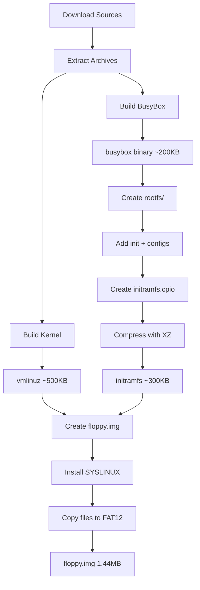

# MicroLinux: 1.44MB Bootable Linux Distribution

## Description

MicroLinux is a complete Linux operating system that fits on a 1.44MB floppy disk (1,474,560 bytes). It provides a bootable rescue environment with shell access, core Unix utilities, and basic disk tools. The system boots via SYSLINUX, loads a compressed Linux kernel, and unpacks an initramfs containing BusyBox userspace.

**Target Platform:** x86 (i686), bootable in QEMU and on real hardware with floppy drive
**Build Host:** Linux (Debian/Ubuntu/Fedora/Arch)
**Output:** Single `floppy.img` file, exactly 1,474,560 bytes

## Functionality

### Core Features

1. **Bootable System** — Boots from floppy/floppy image via SYSLINUX bootloader
2. **Linux Kernel 6.6 LTS** — Minimal monolithic kernel with essential drivers only
3. **BusyBox Userspace** — Static binary providing shell and ~50 core utilities
4. **Interactive Shell** — ash shell with tab completion and command history
5. **Rescue Capabilities** — Mount filesystems, edit files, partition disks

### Boot Sequence

```
BIOS → SYSLINUX → vmlinuz → initramfs unpack → /init → shell
```

### User Interface

- Text-mode console (VGA 80x25 or serial 115200 baud)
- Login-free root shell (rescue system, no authentication)
- Boot menu with 3 options: Normal, Serial Console, Emergency Shell

### Available Commands (BusyBox Applets)

**Shell:** ash, sh  
**Files:** ls, cp, mv, rm, mkdir, rmdir, cat, head, tail, touch, ln, chmod, chown  
**Text:** grep, sed, awk, cut, sort, uniq, wc, tr, vi  
**Archive:** tar, gzip, gunzip, xz, unxz  
**System:** mount, umount, ps, kill, dmesg, free, uptime, sync, halt, reboot, poweroff  
**Disk:** fdisk, mkfs.ext2, mkfs.vfat, blkid, dd, losetup  
**Misc:** date, echo, env, expr, id, uname, whoami, sleep, true, false, yes

## Technical Implementation

### Project Structure

```
microlinux/
├── build.sh                    # Master orchestration script
├── clean.sh                    # Cleanup script  
├── test.sh                     # QEMU test launcher
├── config/
│   ├── kernel.config           # Linux kernel config fragment
│   └── busybox.config          # BusyBox full config
├── rootfs/
│   ├── init                    # PID 1 init script (shell)
│   └── etc/
│       ├── inittab             # BusyBox init config
│       ├── passwd              # User database
│       ├── group               # Group database
│       ├── shadow              # Shadow passwords
│       └── profile             # Shell profile
├── src/                        # Downloaded tarballs (generated)
├── build/                      # Build workspace (generated)
└── output/
    ├── vmlinuz                 # Compressed kernel
    ├── initramfs               # Compressed root filesystem
    └── floppy.img              # Final bootable image
```

### Build Pipeline



### Version Pinning

| Component | Version | Source URL |
|-----------|---------|------------|
| Linux Kernel | 6.6.70 | `https://cdn.kernel.org/pub/linux/kernel/v6.x/linux-6.6.70.tar.xz` |
| BusyBox | 1.36.1 | `https://busybox.net/downloads/busybox-1.36.1.tar.bz2` |

### Size Budget

| Component | Target Size | Maximum |
|-----------|-------------|---------|
| SYSLINUX + config | 20 KB | 25 KB |
| Kernel (vmlinuz) | 500 KB | 600 KB |
| Initramfs (compressed) | 350 KB | 450 KB |
| FAT12 overhead | 50 KB | 60 KB |
| **Total** | **920 KB** | **1,135 KB** |
| **Headroom** | **554 KB** | **339 KB** |

### Kernel Configuration Strategy

Start from `make tinyconfig` (smallest possible config), then enable ONLY:

```
# REQUIRED - Boot fundamentals
CONFIG_BLK_DEV_INITRD=y          # Load initramfs
CONFIG_RD_GZIP=y                 # Decompress gzip initramfs
CONFIG_RD_XZ=y                   # Decompress XZ initramfs
CONFIG_BINFMT_ELF=y              # Run ELF binaries
CONFIG_BINFMT_SCRIPT=y           # Run #! scripts

# REQUIRED - Console
CONFIG_TTY=y                     # Terminal subsystem
CONFIG_VT=y                      # Virtual terminals
CONFIG_VT_CONSOLE=y              # Console on VT
CONFIG_VGA_CONSOLE=y             # VGA text mode
CONFIG_SERIAL_8250=y             # Serial port driver
CONFIG_SERIAL_8250_CONSOLE=y     # Console on serial

# REQUIRED - Input
CONFIG_INPUT=y                   # Input subsystem
CONFIG_INPUT_KEYBOARD=y          # Keyboard support
CONFIG_KEYBOARD_ATKBD=y          # AT keyboard
CONFIG_SERIO=y                   # Serial I/O
CONFIG_SERIO_I8042=y             # i8042 controller

# REQUIRED - Storage
CONFIG_BLOCK=y                   # Block devices
CONFIG_BLK_DEV_FD=y              # Floppy disk
CONFIG_ATA=y                     # ATA/IDE support
CONFIG_ATA_PIIX=y                # Intel PIIX PATA
CONFIG_BLK_DEV_LOOP=y            # Loop devices

# REQUIRED - Filesystems
CONFIG_EXT2_FS=y                 # ext2 filesystem
CONFIG_VFAT_FS=y                 # FAT filesystem
CONFIG_PROC_FS=y                 # /proc
CONFIG_SYSFS=y                   # /sys
CONFIG_DEVTMPFS=y                # /dev auto-populate
CONFIG_DEVTMPFS_MOUNT=y          # Auto-mount devtmpfs
CONFIG_TMPFS=y                   # tmpfs for /tmp

# REQUIRED - Compression
CONFIG_KERNEL_XZ=y               # XZ kernel compression

# OPTIMIZATION
CONFIG_CC_OPTIMIZE_FOR_SIZE=y    # -Os compiler flag
CONFIG_EMBEDDED=y                # Embedded options
CONFIG_EXPERT=y                  # Expert options

# DISABLE (explicit)
# CONFIG_MODULES is not set       # No loadable modules
# CONFIG_SMP is not set           # Single CPU only
# CONFIG_NET is not set           # No networking
# CONFIG_SOUND is not set         # No audio
# CONFIG_USB_SUPPORT is not set   # No USB
# CONFIG_DEBUG_KERNEL is not set  # No debug
```

### BusyBox Configuration Strategy

Start from `make defconfig`, then:

1. Set `CONFIG_STATIC=y` (static linking, no libc dependency)
2. Set `CONFIG_EXTRA_CFLAGS="-Os -fomit-frame-pointer"`
3. Disable all networking applets (ifconfig, ping, wget, etc.)
4. Disable all daemon applets (httpd, telnetd, syslogd, etc.)
5. Disable package managers (dpkg, rpm, apk)
6. Disable module utilities (modprobe, insmod, etc.)
7. Keep only applets listed in "Available Commands" above

### Init Script Specification

**File:** `/init` (in initramfs root)  
**Interpreter:** `#!/bin/sh` (BusyBox ash)  
**Permissions:** 755

**Execution Flow:**
1. Mount `/proc` (type: proc)
2. Mount `/sys` (type: sysfs)
3. Mount `/dev` (type: devtmpfs) OR run `mdev -s` if devtmpfs fails
4. Create `/dev/pts` and mount devpts
5. Create `/dev/shm` and mount tmpfs
6. Mount tmpfs on `/tmp` and `/var`
7. Create `/var/log` and `/var/run` directories
8. Set hostname to "micro"
9. Display ASCII art banner and system info
10. Check for `init=/bin/sh` in `/proc/cmdline` → emergency shell
11. If `/etc/inittab` exists → exec `/sbin/init`
12. Otherwise → exec `/bin/sh -l` directly

### Inittab Specification

**File:** `/etc/inittab`  
**Format:** BusyBox init format

```
::sysinit:/bin/mount -o remount,rw /
::respawn:-/bin/sh
ttyS0::respawn:-/bin/sh
::ctrlaltdel:/sbin/reboot
::shutdown:/bin/umount -a -r
::shutdown:/sbin/swapoff -a
```

### SYSLINUX Configuration

**File:** `syslinux.cfg` (on floppy FAT12 root)

```
DEFAULT linux
PROMPT 1
TIMEOUT 30
SAY MicroLinux - Press ENTER or wait 3s to boot

LABEL linux
    KERNEL vmlinuz
    APPEND initrd=initram quiet

LABEL serial  
    KERNEL vmlinuz
    APPEND initrd=initram console=ttyS0,115200

LABEL emergency
    KERNEL vmlinuz
    APPEND initrd=initram init=/bin/sh
```

**Note:** Initramfs filename must be 8.3 format: `initram` not `initramfs`

### Floppy Image Creation

1. Create 1,474,560 byte file: `dd if=/dev/zero of=floppy.img bs=512 count=2880`
2. Create FAT12 filesystem: `mkfs.vfat -F 12 -n MICROLINUX floppy.img`
3. Install bootloader: `syslinux --install floppy.img`
4. Mount image: `mount -o loop floppy.img /mnt`
5. Copy kernel: `cp vmlinuz /mnt/vmlinuz`
6. Copy initramfs: `cp initramfs /mnt/initram`
7. Copy config: `cp syslinux.cfg /mnt/syslinux.cfg`
8. Unmount: `umount /mnt`

## Data Models

### Environment Variables (in running system)

```sh
PATH=/bin:/sbin:/usr/bin:/usr/sbin
HOME=/root
TERM=linux
PS1='\[\033[1;32m\]micro\[\033[0m\]:\[\033[1;34m\]\w\[\033[0m\]\$ '
```

### /etc/passwd Format

```
root:x:0:0:root:/root:/bin/sh
nobody:x:65534:65534:Nobody:/nonexistent:/bin/false
```

### /etc/group Format

```
root:x:0:
nogroup:x:65534:
```

### /etc/shadow Format

```
root::0:0:99999:7:::
nobody:*:0:0:99999:7:::
```

### Rootfs Directory Structure

```
/
├── bin/
│   ├── busybox         # Main binary (~200KB)
│   ├── sh -> busybox   # Symlinks for all applets
│   ├── ls -> busybox
│   └── ... (50+ symlinks)
├── sbin/
│   ├── init -> ../bin/busybox
│   ├── halt -> ../bin/busybox
│   ├── reboot -> ../bin/busybox
│   └── poweroff -> ../bin/busybox
├── usr/
│   ├── bin/            # Empty or symlinks
│   └── sbin/           # Empty or symlinks
├── etc/
│   ├── inittab
│   ├── passwd
│   ├── group
│   ├── shadow
│   ├── profile
│   └── issue
├── dev/                # Populated by devtmpfs
│   ├── pts/
│   └── shm/
├── proc/               # Mounted procfs
├── sys/                # Mounted sysfs
├── tmp/                # Mounted tmpfs
├── var/
│   ├── log/
│   └── run/
├── root/               # Root home directory
└── init                # PID 1 script
```

## Testing Scenarios

### Test 1: QEMU Boot (GUI)

```bash
qemu-system-i386 -fda output/floppy.img -m 64M
```

**Expected:** Window opens, SYSLINUX prompt appears, boots to shell within 5 seconds

### Test 2: QEMU Boot (Serial)

```bash
qemu-system-i386 -fda output/floppy.img -m 64M -nographic -serial mon:stdio
```

**Expected:** Boot messages appear in terminal, shell prompt `micro:/#` appears  
**Exit:** Press `Ctrl-A X`

### Test 3: Basic Commands

```bash
# In booted system:
uname -a          # Should show "Linux micro 6.6.x"
busybox --list    # Should show ~50 applets
ls /              # Should show standard directories
cat /proc/cpuinfo # Should show CPU info
free              # Should show memory (~64MB)
mount             # Should show proc, sys, dev, tmp mounts
```

### Test 4: Disk Operations

```bash
# Create and mount loop device:
dd if=/dev/zero of=/tmp/test.img bs=1M count=1
losetup /dev/loop0 /tmp/test.img
mkfs.ext2 /dev/loop0
mkdir /mnt
mount /dev/loop0 /mnt
echo "test" > /mnt/file.txt
cat /mnt/file.txt   # Should output "test"
umount /mnt
losetup -d /dev/loop0
```

### Test 5: Emergency Mode

```bash
qemu-system-i386 -fda output/floppy.img -m 64M -append "init=/bin/sh" -kernel output/vmlinuz -initrd output/initramfs
```

**Expected:** Drops directly to shell without running /init script

### Test 6: Size Validation

```bash
stat -c%s output/floppy.img
# Must output exactly: 1474560

stat -c%s output/vmlinuz
# Should be < 600000 (600KB)

stat -c%s output/initramfs  
# Should be < 450000 (450KB)
```

## Error Handling

### Build Errors

| Error | Cause | Resolution |
|-------|-------|------------|
| `make: *** No rule to make target` | Missing source | Re-run download stage |
| `fatal error: openssl/opensslv.h` | Missing dev package | Install `libssl-dev` |
| `flex: command not found` | Missing tool | Install `flex` |
| `Cannot open /dev/loop0` | Need root for loop | Use `sudo` for mount commands |
| `syslinux: command not found` | Missing package | Install `syslinux` |

### Boot Errors

| Symptom | Cause | Resolution |
|---------|-------|------------|
| "No DEFAULT or UI" | Missing syslinux.cfg | Verify file copied to image |
| "Could not find kernel" | vmlinuz not found | Check 8.3 filename, verify copy |
| "Kernel panic - VFS" | Can't mount initramfs | Check CONFIG_RD_* matches compression |
| "No init found" | Missing /init | Verify init in rootfs, check permissions |
| Blank screen | No console driver | Add `console=ttyS0,115200` to cmdline |
| Keyboard unresponsive | Missing i8042 driver | Enable CONFIG_SERIO_I8042 |

### Runtime Errors

| Error | Cause | Resolution |
|-------|-------|------------|
| "sh: can't access tty" | No controlling terminal | Normal for some boot modes, ignore |
| "mount: mounting X failed" | Missing fs driver | Enable filesystem in kernel config |
| "command not found" | Applet not enabled | Rebuild BusyBox with applet |

## Build Script Interface

### Main Script: `build.sh`

**Usage:**
```bash
./build.sh              # Full build
./build.sh clean        # Remove build artifacts
./build.sh download     # Download sources only
./build.sh kernel       # Build kernel only
./build.sh busybox      # Build BusyBox only
./build.sh rootfs       # Create rootfs only
./build.sh initramfs    # Create initramfs only
./build.sh floppy       # Create floppy image only
```

**Exit Codes:**
- 0: Success
- 1: Build error
- 2: Size exceeded (image > 1,474,560 bytes)
- 3: Missing dependency

**Output:**
- Colorized progress messages to stdout
- Errors to stderr
- Final image at `output/floppy.img`

### Test Script: `test.sh`

**Usage:**
```bash
./test.sh           # GUI mode (default)
./test.sh serial    # Serial console mode
./test.sh curses    # Curses display mode
./test.sh debug     # Debug mode with interrupt logging
```

### Clean Script: `clean.sh`

**Usage:**
```bash
./clean.sh          # Remove build/ and output/
./clean.sh all      # Also remove src/ (downloaded files)
```

## Host Dependencies

### Required Packages (Debian/Ubuntu)

```bash
apt install build-essential gcc g++ make bison flex libelf-dev \
    libssl-dev bc cpio xz-utils zstd syslinux dosfstools mtools \
    qemu-system-x86 wget ncurses-dev perl
```

### Required Packages (Fedora)

```bash
dnf install @development-tools gcc gcc-c++ make bison flex \
    elfutils-libelf-devel openssl-devel bc cpio xz zstd syslinux \
    dosfstools mtools qemu-system-x86 wget ncurses-devel perl
```

### Required Packages (Arch)

```bash
pacman -S base-devel bc cpio xz zstd syslinux dosfstools mtools \
    qemu wget ncurses perl libelf openssl
```

## Performance Goals

| Metric | Target | Maximum |
|--------|--------|---------|
| Build time (first) | 5 min | 15 min |
| Build time (incremental) | 30 sec | 2 min |
| Boot time (QEMU) | 2 sec | 5 sec |
| Memory usage | 16 MB | 32 MB |
| Image size | 920 KB | 1,440 KB |

## Extended Features (Optional)

If space permits after core build, consider adding:

1. **Networking** (+100KB kernel, +50KB BusyBox)
   - Enable CONFIG_NET, CONFIG_INET, CONFIG_VIRTIO_NET
   - Enable ifconfig, route, ping applets

2. **USB Support** (+50KB kernel)
   - Enable CONFIG_USB, CONFIG_USB_STORAGE
   - Useful for real hardware rescue

3. **Compression Tools** (+20KB BusyBox)
   - Add bzip2, lzma applets

4. **Text Utilities** (+15KB BusyBox)
   - Add less, more, diff applets

---

## Implementation Notes for Claude Code

1. **Generate all files in sequence** — Start with directory structure, then configs, then scripts
2. **Use heredocs for multi-line content** — Cleaner than echo statements
3. **Make scripts executable** — Add `chmod +x` after creating .sh files
4. **Validate sizes after each major step** — Fail fast if over budget
5. **Use QEMU for testing** — Don't require real floppy hardware
6. **Prefer XZ compression** — Best ratio for small payloads
7. **Static BusyBox only** — No dynamic linking, no libc needed in rootfs

---

*TINS README v1.0 — Sufficient for complete implementation generation*
