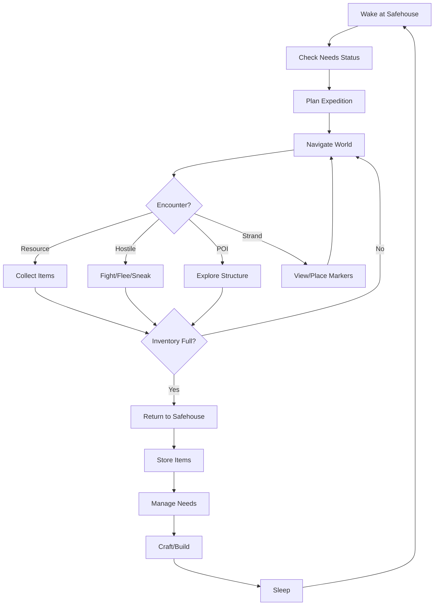
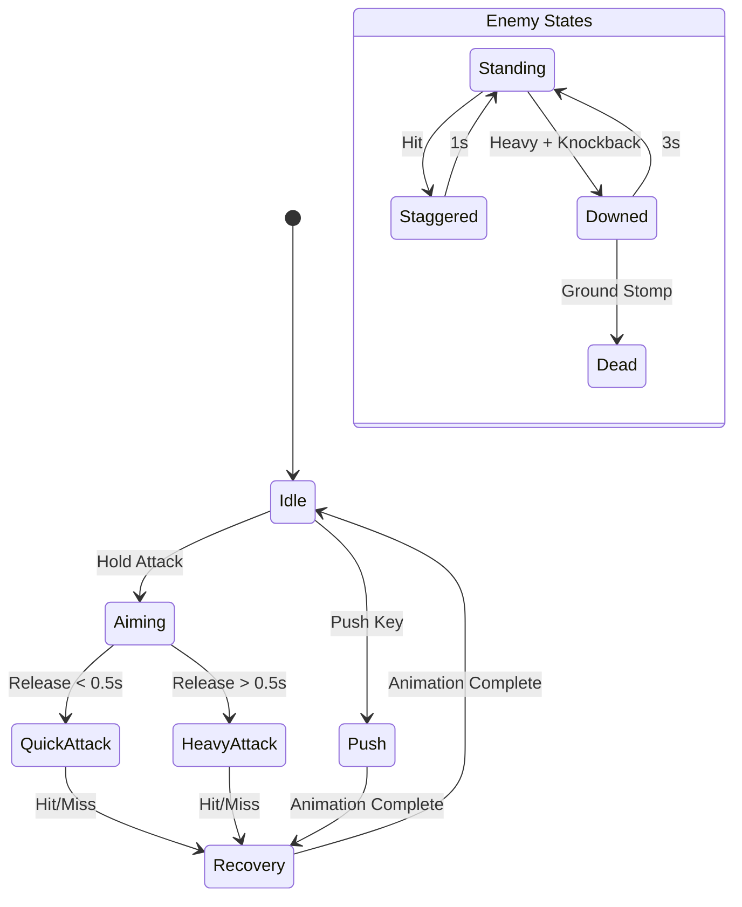
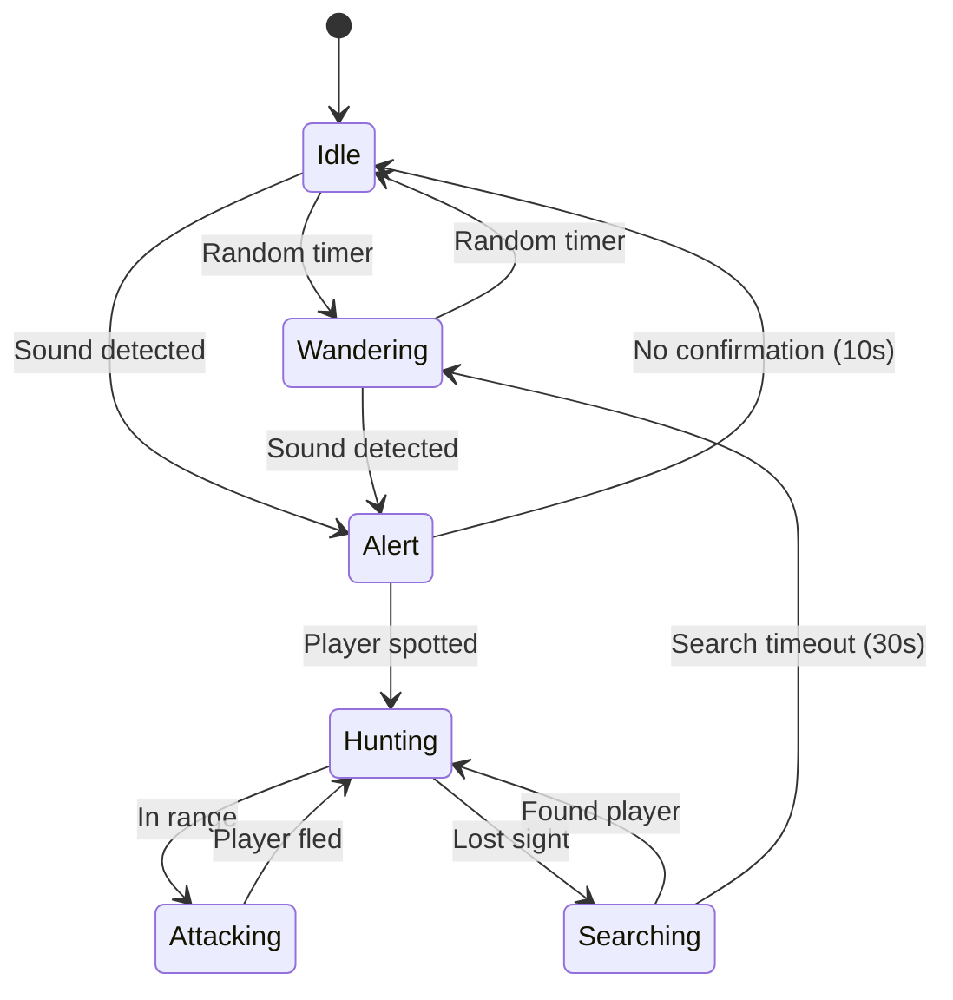

# REACT-Z

An isometric survival game built with React Three.js featuring asynchronous multiplayer "strand" mechanics. Players navigate a post-apocalyptic desert wasteland, managing survival needs while building safehouses and leaving traces to help future players.

## Description

REACT-Z is a browser-based isometric survival game combining real-time 3D rendering (React Three Fiber + drei) with 2D UI overlays (Fabric.js or React components). Players control a survivor in a hostile desert environment, managing thirst, hunger, sleep, and temperature while scavenging resources, crafting tools, building shelter, and avoiding hostile creatures called "Devourers."

The game features a unique "Strand System" for asynchronous multiplayer—players never meet directly but leave markers, echoes, and structures that persist across game instances, creating emergent cooperation between strangers. A hidden "Ka-weight" system tracks player behavior, subtly affecting gameplay difficulty and strand visibility based on whether players act generously or selfishly.

**Key Features:**
- Isometric 3D view with wireframe aesthetic and vertex-shaded terrain
- Real-time survival mechanics (thirst, hunger, sleep, temperature, strain)
- Day/night cycle affecting hostile behavior and environmental hazards
- Melee combat with weapon degradation and stamina management
- Base building with carpentry progression system
- Asynchronous strand multiplayer (markers, echoes, shared structures)
- Hidden karma system affecting game difficulty
- Permadeath with item recovery mechanic

---

## Functionality

### 1. Game States

The application manages these primary states:

```
┌─────────────┐     ┌─────────────┐     ┌─────────────┐
│  MAIN_MENU  │────▶│  CHARACTER  │────▶│   PLAYING   │
│             │     │  CREATION   │     │             │
└─────────────┘     └─────────────┘     └──────┬──────┘
       ▲                                       │
       │            ┌─────────────┐            │
       │            │    DEAD     │◀───────────┤
       │            │  (respawn)  │            │
       │            └──────┬──────┘            │
       │                   │                   │
       │            ┌──────▼──────┐            │
       └────────────│  GAME_OVER  │◀───────────┘
                    │ (no safehouse)│
                    └─────────────┘
```

**State Transitions:**
- `MAIN_MENU` → `CHARACTER_CREATION`: Player clicks "New Game"
- `CHARACTER_CREATION` → `PLAYING`: Player confirms character
- `PLAYING` → `DEAD`: Player health reaches 0
- `DEAD` → `PLAYING`: Auto-respawn at safehouse after 3 seconds
- `DEAD` → `GAME_OVER`: No safehouse established
- `GAME_OVER` → `MAIN_MENU`: Any input
- `PLAYING` → `MAIN_MENU`: Player saves and exits

### 2. Core Gameplay Loop



### 3. User Interface Layout

```
┌────────────────────────────────────────────────────────────┐
│ [Health Bar] [Strain Bar]              [Time] [Day Count] │ ← Top HUD
├────────────────────────────────────────────────────────────┤
│                                                            │
│                                                            │
│                    3D GAME WORLD                           │
│                  (Isometric View)                          │
│                                                            │
│                                                            │
│                                                            │
├────────────────────────────────────────────────────────────┤
│ [Thirst][Hunger][Sleep][Temp]    [Quick Slots 1-4]        │ ← Bottom HUD
└────────────────────────────────────────────────────────────┘

[TAB] Opens Inventory Panel (center overlay)
[M] Opens Map Panel (center overlay)  
[B] Opens Build Menu (right side panel)
[ESC] Opens Pause Menu (center overlay)
```

**HUD Elements Specification:**

| Element | Position | Size | Display |
|---------|----------|------|---------|
| Health Bar | Top-left | 200x20px | Red gradient, numeric value |
| Strain Bar | Below health | 200x12px | Yellow gradient |
| Time Display | Top-right | Text | "HH:MM" + sun/moon icon |
| Day Counter | Below time | Text | "Day X" |
| Thirst Icon | Bottom-left | 32x32px | Water drop, fill percentage |
| Hunger Icon | Next to thirst | 32x32px | Food icon, fill percentage |
| Sleep Icon | Next to hunger | 32x32px | Moon icon, fill percentage |
| Temp Icon | Next to sleep | 32x32px | Thermometer, color-coded |
| Quick Slots | Bottom-right | 4x 48x48px | Item icons with quantity |

### 4. Character Creation

**Screen Layout:**
```
┌─────────────────────────────────────────────────────────┐
│                    CREATE SURVIVOR                       │
├─────────────────────────────────────────────────────────┤
│  Name: [________________]                                │
│                                                          │
│  Available Points: [8]                                   │
│                                                          │
│  ┌─────────────────┐  ┌─────────────────┐               │
│  │ POSITIVE TRAITS │  │ NEGATIVE TRAITS │               │
│  ├─────────────────┤  ├─────────────────┤               │
│  │ [ ] Brave (-4)  │  │ [ ] Slow Heal(+4)│               │
│  │ [ ] Strong (-6) │  │ [ ] Weak Stom(+3)│               │
│  │ [ ] Fast Read(-2)│  │ [ ] Heat Sens(+3)│               │
│  │ [ ] Desert B(-4)│  │ [ ] Poor Sight(+2)│               │
│  │ [ ] Athletic(-4)│  │ [ ] Smoker (+2)  │               │
│  └─────────────────┘  └─────────────────┘               │
│                                                          │
│  Starting Location:                                      │
│  ( ) Abandoned Ranch [Easy]                              │
│  ( ) Highway Rest Stop [Medium]                          │
│  (•) Collapsed Town [Hard]                               │
│                                                          │
│           [CONFIRM]  [RANDOMIZE]  [BACK]                 │
└─────────────────────────────────────────────────────────┘
```

**Trait Definitions:**

| Trait | Points | Effect |
|-------|--------|--------|
| Brave | -4 | Panic threshold +50%, aim stability +20% |
| Strong | -6 | Carry capacity +30%, melee damage +15%, strain capacity +25% |
| Fast Reader | -2 | Skill book reading speed +30% |
| Desert Born | -4 | Heat exhaustion threshold +40%, water consumption -20% |
| Athletic | -4 | Sprint speed +15%, sprint stamina +20% |
| Slow Healer | +4 | Wound healing time x2 |
| Weak Stomach | +3 | Food poisoning chance +40% |
| Heat Sensitive | +3 | Heat exhaustion threshold -30%, water consumption +25% |
| Poor Night Vision | +2 | Night visibility radius -40% |
| Smoker | +2 | Requires cigarettes; withdrawal causes accuracy -30%, stress +50% |

### 5. Movement & Navigation

**Controls:**
| Input | Action |
|-------|--------|
| WASD / Arrow Keys | Move in cardinal directions |
| Shift + Move | Sprint (consumes stamina, adds strain) |
| Ctrl + Move | Sneak (slower, reduces detection) |
| Space | Interact / Pick up |
| Mouse | Rotate camera (limited 45° snapping) |
| Scroll | Zoom in/out (3 levels) |

**Movement Speed Values:**
| State | Speed (units/sec) | Stamina Cost | Noise Level |
|-------|-------------------|--------------|-------------|
| Walk | 3.0 | 0 | Low |
| Sprint | 6.0 | 2/sec | High |
| Sneak | 1.5 | 0 | Very Low |
| Overburdened | 1.0 | 1/sec | Medium |
| Crawl | 0.5 | 0 | Minimal |

**Encumbrance System:**
```
carryWeight = sum(item.weight for item in inventory)
maxCarry = 20 + (strengthBonus * 6)  // Base 20, +6 per Strength point

if carryWeight <= maxCarry:
    movementMultiplier = 1.0
    state = "normal"
elif carryWeight <= maxCarry * 1.5:
    movementMultiplier = 0.6
    state = "burdened"
    strainRate += 0.5  // per second
else:
    movementMultiplier = 0.2
    state = "overburdened"
    strainRate += 2.0
```

### 6. Survival Needs System

**Need Depletion Rates (per in-game hour):**

| Need | Base Rate | Environmental Modifiers |
|------|-----------|------------------------|
| Thirst | -4 | Hot (+3), Sprinting (+2), Desert Born (-1) |
| Hunger | -2 | Sprinting (+1), Cold (+1) |
| Sleep | -1.5 | Combat (+2 per fight), Insomnia trait (+0.5) |
| Temperature | Variable | See Temperature System |

**Need Thresholds and Effects:**

```
THIRST (0-100):
  100-75: Normal
  75-50: "Parched" - stamina regen -25%
  50-25: "Dehydrated" - accuracy -20%, vision blur edges
  25-10: "Severe Dehydration" - hallucination chance, damage over time
  10-0: "Dying" - rapid health loss, collapse imminent

HUNGER (0-100):
  100-75: Normal
  75-50: "Hungry" - healing rate -25%
  50-25: "Starving" - strength -1, carry capacity reduced
  25-10: "Famished" - all stats -20%, fainting chance
  10-0: "Dying" - health loss, weakness

SLEEP (0-100):
  100-75: Normal
  75-50: "Tired" - accuracy -10%
  50-25: "Exhausted" - reaction time +30%, blur effect
  25-10: "Sleep Deprived" - hallucinations, random stumbling
  10-0: "Collapse" - forced unconsciousness for 4 hours

TEMPERATURE (-50 to 150, optimal 70-85):
  Below 40: "Hypothermia" - movement slow, health drain
  40-70: "Cold" - hunger depletes faster
  70-85: "Comfortable" - normal
  85-100: "Hot" - thirst depletes faster
  100-120: "Heat Exhaustion" - stamina regen halted
  Above 120: "Heat Stroke" - health drain, collapse risk
```

### 7. Day/Night Cycle

**Time Configuration:**
- 1 real second = 1 in-game minute (configurable)
- Full day/night cycle = 24 in-game hours = 24 real minutes
- Game starts at Day 1, 8:00 AM

**Time Phases:**

| Phase | Hours | Ambient Light | Hostile Activity | Temperature |
|-------|-------|---------------|------------------|-------------|
| Dawn | 5:00-7:00 | 0.3 → 0.7 | Retreating (0.3x) | Rising |
| Morning | 7:00-11:00 | 0.7 → 1.0 | Low (0.5x) | Warm |
| Noon | 11:00-14:00 | 1.0 | Minimal (0.2x) | Hot (danger) |
| Afternoon | 14:00-18:00 | 1.0 → 0.7 | Increasing (0.7x) | Cooling |
| Dusk | 18:00-20:00 | 0.7 → 0.3 | Active (1.0x) | Cool |
| Night | 20:00-5:00 | 0.1-0.2 | Peak (1.5x) | Cold (danger) |

**Lighting Implementation:**
```javascript
const ambientIntensity = calculateAmbientLight(gameTime);
// Range: 0.1 (midnight) to 1.0 (noon)
// Smooth interpolation between phases

const sunPosition = calculateSunPosition(gameTime);
// Arc from east to west during day
// Below horizon at night

const shadowLength = calculateShadowLength(gameTime);
// Long at dawn/dusk, short at noon, none at night
```

### 8. Combat System

**Attack Types:**

| Attack | Damage Mult | Strain Cost | Speed | Knockback |
|--------|-------------|-------------|-------|-----------|
| Quick | 1.0x | 5 | Fast | None |
| Heavy | 2.0x | 15 | Slow | Strong |
| Push | 0x | 3 | Fast | Medium |
| Ground Stomp | 3.0x | 10 | Slow | N/A (downed only) |

**Combat Flow:**


**Weapon Condition System:**

```typescript
interface WeaponCondition {
  head: number;      // 0-100, affects damage
  handle: number;    // 0-100, affects speed and break chance
  sharpness?: number; // 0-100, bladed weapons only
}

// Degradation per hit:
const degradeWeapon = (weapon: Weapon, hitType: 'hit' | 'miss' | 'block') => {
  const baseDamage = hitType === 'hit' ? 2 : hitType === 'block' ? 3 : 0.5;
  weapon.condition.head -= baseDamage * (1 + Math.random() * 0.5);
  weapon.condition.handle -= baseDamage * 0.5;
  if (weapon.condition.sharpness !== undefined) {
    weapon.condition.sharpness -= baseDamage * 1.5;
  }
  
  // Break chance when handle < 20
  if (weapon.condition.handle < 20 && Math.random() < 0.1) {
    return 'BROKEN';
  }
};
```

**Strain System:**
```
strain (0-100):
  0-25: Normal operation
  25-50: Accuracy -10%, swing speed -10%
  50-75: Accuracy -25%, swing speed -25%, damage -15%
  75-100: Accuracy -40%, swing speed -40%, damage -30%, injury risk

strainRecovery:
  Standing still: -2/second
  Walking: -1/second
  In safehouse: -4/second
  Sleeping: -10/second
  Ritual action (eating mindfully): -15 instant
```

### 9. Hostile AI (Devourers)

**AI State Machine:**



**Detection System:**

```typescript
interface DetectionFactors {
  visionCone: number;      // degrees, default 90
  visionRange: number;     // units, default 15
  hearingRange: number;    // units, default 25
  smellRange: number;      // units, corpse detection
}

const calculateDetection = (hostile: Hostile, player: Player): number => {
  let detection = 0;
  const distance = getDistance(hostile.position, player.position);
  const angle = getAngle(hostile.facing, player.position);
  
  // Vision (blocked by walls, affected by light)
  if (angle < hostile.visionCone / 2 && hasLineOfSight(hostile, player)) {
    const lightFactor = getAmbientLight(); // 0.1-1.0
    const distanceFactor = 1 - (distance / hostile.visionRange);
    detection += distanceFactor * lightFactor * 50;
  }
  
  // Hearing (through walls, louder actions = farther)
  const noiseLevel = player.currentNoiseLevel; // 0-1
  if (distance < hostile.hearingRange * noiseLevel) {
    detection += 30 * noiseLevel;
  }
  
  // Ka-weight modifier (hidden system)
  detection *= player.kaWeightMultiplier; // 0.8-1.3
  
  return detection; // > 100 = spotted
};
```

**Hostile Types:**

| Type | Health | Speed | Damage | Special |
|------|--------|-------|--------|---------|
| Shambler | 50 | 1.5 | 10 | Basic, slow |
| Runner | 30 | 5.0 | 8 | Fast, fragile |
| Brute | 150 | 2.0 | 25 | Tanky, knockback resistant |
| Stalker | 40 | 3.0 | 15 | Ambush, better detection |

### 10. Inventory System

**Inventory Structure:**
```typescript
interface Inventory {
  mainSlots: InventorySlot[]; // 20 slots
  quickSlots: InventorySlot[]; // 4 slots
  equipped: {
    weapon: Item | null;
    backpack: Container | null;
    clothing: Item[];
  };
}

interface InventorySlot {
  item: Item | null;
  quantity: number; // for stackables
}

interface Item {
  id: string;
  name: string;
  weight: number;
  stackable: boolean;
  maxStack: number;
  category: 'weapon' | 'food' | 'water' | 'medical' | 'material' | 'tool' | 'misc';
  condition?: number;
  effects?: ItemEffect[];
}

interface Container extends Item {
  capacity: number; // max weight
  weightReduction: number; // 0.15-0.4 (reduces contained item weight)
  slots: InventorySlot[];
}
```

**Inventory UI:**
```
┌─────────────────────────────────────────────────────────┐
│  INVENTORY                           Weight: 15.2/26.0  │
├─────────────────────────────────────────────────────────┤
│  ┌────┬────┬────┬────┬────┐   ┌─────────────────────┐  │
│  │ 1  │ 2  │ 3  │ 4  │ 5  │   │  SELECTED ITEM      │  │
│  ├────┼────┼────┼────┼────┤   │                     │  │
│  │ 6  │ 7  │ 8  │ 9  │ 10 │   │  [Icon]             │  │
│  ├────┼────┼────┼────┼────┤   │  Canned Beans       │  │
│  │ 11 │ 12 │ 13 │ 14 │ 15 │   │  Weight: 0.5        │  │
│  ├────┼────┼────┼────┼────┤   │  Hunger: +25        │  │
│  │ 16 │ 17 │ 18 │ 19 │ 20 │   │  Requires: Can Opener│  │
│  └────┴────┴────┴────┴────┘   │                     │  │
│                                │  [USE] [DROP] [INFO]│  │
│  BACKPACK (12.0/15.0)          └─────────────────────┘  │
│  ┌────┬────┬────┬────┬────┬────┐                        │
│  │ B1 │ B2 │ B3 │ B4 │ B5 │ B6 │                        │
│  └────┴────┴────┴────┴────┴────┘                        │
│                                                          │
│  QUICK SLOTS                                             │
│  ┌────┬────┬────┬────┐                                  │
│  │ Q1 │ Q2 │ Q3 │ Q4 │  (Keys 1-4 to use)               │
│  └────┴────┴────┴────┘                                  │
└─────────────────────────────────────────────────────────┘
```

### 11. Base Building System

**Construction Menu:**
```
BUILD MENU (B)
├── Barricades (Carpentry 1)
│   ├── Wooden Barricade (2 planks)
│   └── Sheet Cover (1 sheet)
├── Structures (Carpentry 2)
│   ├── Wooden Wall (4 planks, 2 nails)
│   ├── Wooden Floor (3 planks, 2 nails)
│   └── Wooden Fence (2 planks, 1 nail)
├── Furniture (Carpentry 3)
│   ├── Rain Collector (4 planks, 4 garbage bags)
│   ├── Storage Crate (3 planks, 2 nails)
│   └── Bed Frame (6 planks, 4 nails)
├── Advanced (Carpentry 4)
│   ├── Stairs (8 planks, 6 nails)
│   └── Reinforced Door (6 planks, 4 metal sheets)
└── Fortification (Carpentry 5)
    ├── Metal Wall (4 metal sheets, 6 screws)
    └── Watchtower Platform (12 planks, 8 nails)
```

**Placement System:**
```typescript
interface BuildableObject {
  id: string;
  name: string;
  size: { x: number; y: number; z: number }; // grid units
  requiredMaterials: { itemId: string; quantity: number }[];
  requiredSkill: { skill: string; level: number };
  buildTime: number; // seconds
  health: number;
  placementRules: PlacementRule[];
}

type PlacementRule = 
  | { type: 'requiresGround' }
  | { type: 'requiresWall' }
  | { type: 'requiresFoundation' }
  | { type: 'noOverlap' }
  | { type: 'mustConnect'; to: string };

// Placement preview shows green (valid) or red (invalid)
// Ghost preview follows cursor on grid
// Left click to confirm, right click to cancel
```

**Safehouse Designation:**
```typescript
interface Safehouse {
  center: Vector3;
  radius: number; // detected enclosed area
  completionScore: number; // 0-100 based on criteria
  criteria: {
    hasWater: boolean;      // Rain collector or stored water
    hasFood: boolean;       // Storage with food
    hasBed: boolean;        // Bed placed
    hasDefense: boolean;    // All openings barricaded
    hasLight: boolean;      // Light source (lamp, candles)
    hasStrandAnchor: boolean; // Strand marker placed
  };
  respawnPoint: Vector3;
}

// Safehouse auto-detected when enclosed structure meets minimum criteria
// Better completion = lighter death penalties
```

### 12. Strand System (Asynchronous Multiplayer)

**Strand Data Structures:**
```typescript
interface StrandMarker {
  id: string;
  type: 'danger' | 'resource' | 'path' | 'safe' | 'custom';
  position: Vector3;
  creatorKaWeight: number; // affects visibility to similar players
  createdAt: timestamp;
  likes: number;
  icon: string;
}

interface EchoStone {
  id: string;
  position: Vector3;
  recording: {
    duration: number; // 3-5 seconds
    playerActions: PlayerAction[];
    ghostModel: string;
  };
  creatorKaWeight: number;
  views: number;
}

interface SharedStructure {
  id: string;
  type: 'bridge' | 'ladder' | 'shelter' | 'sign';
  position: Vector3;
  health: number;
  contributors: string[]; // player IDs who helped build
  completionPercentage: number;
}
```

**Strand Visibility Algorithm:**
```typescript
const calculateStrandVisibility = (
  player: Player,
  strandItem: StrandMarker | EchoStone
): number => {
  // Base visibility
  let visibility = 0.5;
  
  // Ka-weight similarity (players with similar karma see each other more)
  const weightDiff = Math.abs(player.kaWeight - strandItem.creatorKaWeight);
  const similarityBonus = 1 - (weightDiff / 100);
  visibility += similarityBonus * 0.3;
  
  // Popularity bonus
  const popularityBonus = Math.min(strandItem.likes / 100, 0.2);
  visibility += popularityBonus;
  
  // Player's own ka-weight affects total visibility
  if (player.kaWeight < 40) {
    visibility *= 1.3; // Light players see more
  } else if (player.kaWeight > 70) {
    visibility *= 0.7; // Heavy players see less
  }
  
  return Math.min(visibility, 1.0);
};

// Strand items render with opacity = visibility
// Items below 0.3 visibility are hidden
```

**Collective Construction:**
```typescript
interface CollectiveProject {
  id: string;
  type: 'road' | 'bridge' | 'monument';
  segments: ProjectSegment[];
  totalContributions: number;
  globalProgress: number; // 0-100
  rewards: { threshold: number; reward: string }[];
}

// Example: Highway Restoration Project
// All players contribute materials at waypoints
// Progress tracked globally across all game instances
// Reaching 25%/50%/75%/100% unlocks benefits for all players
```

### 13. Ka-Weight System (Hidden Karma)

**Weight Calculation:**
```typescript
interface KaWeightEvent {
  action: string;
  weightChange: number;
}

const KA_WEIGHT_EVENTS: Record<string, number> = {
  // Increases (negative actions)
  'kill_hostile': +1,
  'excessive_kill': +3,         // Killing non-threatening hostiles
  'waste_water': +5,            // Consuming more water than needed
  'hoard_excess': +2,           // Carrying items you can't use
  'destroy_strand_marker': +10,
  'ignore_echo_plea': +2,       // Walking past "help" echo
  
  // Decreases (positive actions)
  'place_helpful_marker': -2,
  'like_marker': -0.5,
  'build_shared_structure': -5,
  'record_helpful_echo': -3,
  'share_water_source': -4,     // Placing marker at water
  'ritual_action_complete': -1,
  'efficient_consumption': -1,  // Taking only what's needed
};

// Weight range: 0 (lightest) to 100 (heaviest)
// Starting weight: 50 (neutral)
// Weight affects: hostile aggression, strand visibility, death penalties
```

**Weight Effects:**

| Weight Range | Hostile Modifier | Strand Visibility | Death Penalty |
|--------------|------------------|-------------------|---------------|
| 0-30 (Light) | 0.7x aggression | +30% markers visible | Mild (keep 80% items) |
| 30-60 (Neutral) | 1.0x | Normal | Standard (keep 60%) |
| 60-100 (Heavy) | 1.4x aggression | -40% markers | Severe (keep 30%) |

### 14. Skill Progression

**Skill Structure:**
```typescript
interface Skill {
  id: string;
  name: string;
  level: number;     // 0-10
  xp: number;        // current XP
  xpToNext: number;  // XP needed for next level
}

const SKILLS: Skill[] = [
  { id: 'carpentry', name: 'Carpentry', level: 0, xp: 0, xpToNext: 100 },
  { id: 'firstAid', name: 'First Aid', level: 0, xp: 0, xpToNext: 100 },
  { id: 'mechanics', name: 'Mechanics', level: 0, xp: 0, xpToNext: 100 },
  { id: 'cooking', name: 'Cooking', level: 0, xp: 0, xpToNext: 100 },
  { id: 'foraging', name: 'Foraging', level: 0, xp: 0, xpToNext: 100 },
  { id: 'melee', name: 'Melee Combat', level: 0, xp: 0, xpToNext: 100 },
  { id: 'stealth', name: 'Stealth', level: 0, xp: 0, xpToNext: 100 },
];

// XP curve: xpToNext = 100 * (1.5 ^ level)
// Level 1: 100 XP, Level 5: 759 XP, Level 10: 5767 XP
```

**XP Multipliers:**
| Source | Multiplier |
|--------|------------|
| Base action | 1.0x |
| Skill book (matching level range) | 1.5x |
| Radio broadcast (first 2 weeks only) | 1.0x (passive, max level 3) |
| Fast Reader trait | +0.3x to book learning |

**Radio Broadcast Schedule:**
```typescript
const RADIO_BROADCASTS = [
  { time: '06:00', skill: 'cooking', name: 'Desert Cooking' },
  { time: '12:00', skill: 'carpentry', name: 'Makeshift Engineering' },
  { time: '18:00', skill: 'foraging', name: 'Wasteland Survival' },
];

// Broadcasts end after Day 14 (world fully transitions)
// Must be tuned to radio and within range of signal
// Passive XP gain while listening: 5 XP per in-game hour
```

### 15. World Generation

**Tile-Based Map Structure:**
```typescript
interface WorldMap {
  width: number;  // tiles
  height: number; // tiles
  tileSize: number; // world units per tile
  tiles: MapTile[][];
  pois: PointOfInterest[];
  hostileSpawns: SpawnPoint[];
}

interface MapTile {
  type: 'sand' | 'rock' | 'road' | 'structure' | 'water';
  elevation: number;
  traversable: boolean;
  cover: number; // 0-1, stealth bonus
}

interface PointOfInterest {
  id: string;
  type: 'residential' | 'commercial' | 'industrial' | 'military' | 'oasis';
  position: Vector3;
  lootTable: string;
  explored: boolean;
  hostileDensity: number;
}
```

**POI Types:**

| Type | Examples | Loot Quality | Hostile Density | Typical Size |
|------|----------|--------------|-----------------|--------------|
| Residential | Adobe houses, trailers | Basic | Low | 3-5 tiles |
| Commercial | Gas station, store | Mixed | Medium | 5-8 tiles |
| Industrial | Workshop, garage | Tools/parts | Medium | 8-12 tiles |
| Military | Outpost, bunker | Weapons/rare | High | 10-15 tiles |
| Oasis | Water source, palm trees | Water | Very Low | 2-4 tiles |

### 16. Save System

**Save Data Structure:**
```typescript
interface SaveGame {
  version: string;
  timestamp: number;
  
  player: {
    position: Vector3;
    health: number;
    needs: NeedValues;
    strain: number;
    kaWeight: number;
    inventory: Inventory;
    skills: Skill[];
    traits: string[];
    statistics: PlayerStats;
  };
  
  world: {
    day: number;
    time: number;
    exploredTiles: Set<string>;
    lootedContainers: Set<string>;
    hostileStates: HostileState[];
    structures: BuiltStructure[];
    safehouse: Safehouse | null;
  };
  
  strand: {
    placedMarkers: StrandMarker[];
    recordedEchoes: EchoStone[];
    contributions: ContributionRecord[];
  };
}

// Save to localStorage or IndexedDB
// Auto-save every 5 minutes and on safehouse rest
// Single save slot (permadeath philosophy)
```

---

## Technical Implementation

### Architecture Overview

```
┌─────────────────────────────────────────────────────────────┐
│                      REACT APPLICATION                       │
├─────────────────────────────────────────────────────────────┤
│  ┌─────────────┐  ┌─────────────┐  ┌─────────────────────┐  │
│  │   ZUSTAND   │  │   REACT     │  │   REACT THREE      │  │
│  │   STORES    │  │   CONTEXT   │  │   FIBER CANVAS     │  │
│  │             │  │             │  │                     │  │
│  │ - gameState │  │ - settings  │  │ - IsometricCamera   │  │
│  │ - player    │  │ - audio     │  │ - WorldRenderer     │  │
│  │ - world     │  │ - ui mode   │  │ - EntityManager     │  │
│  │ - strand    │  │             │  │ - LightingSystem    │  │
│  └──────┬──────┘  └──────┬──────┘  └──────────┬──────────┘  │
│         │                │                     │             │
│         └────────────────┴─────────────────────┘             │
│                          │                                   │
│  ┌───────────────────────┴───────────────────────────────┐  │
│  │                    GAME LOOP (RAF)                     │  │
│  │  - Input processing                                    │  │
│  │  - Physics/collision                                   │  │
│  │  - AI updates                                          │  │
│  │  - Need depletion                                      │  │
│  │  - Time progression                                    │  │
│  │  - State sync                                          │  │
│  └───────────────────────────────────────────────────────┘  │
│                                                              │
│  ┌────────────────────────────────────────────────────────┐ │
│  │                    2D UI OVERLAY                        │ │
│  │  - HUD components (React)                               │ │
│  │  - Inventory panel                                      │ │
│  │  - Build menu                                           │ │
│  │  - Dialog boxes                                         │ │
│  └────────────────────────────────────────────────────────┘ │
└─────────────────────────────────────────────────────────────┘
```

### Core Dependencies

```json
{
  "dependencies": {
    "react": "^18.2.0",
    "react-dom": "^18.2.0",
    "@react-three/fiber": "^8.15.0",
    "@react-three/drei": "^9.88.0",
    "three": "^0.158.0",
    "zustand": "^4.4.0",
    "immer": "^10.0.0",
    "use-sound": "^4.0.0"
  }
}
```

### State Management (Zustand)

```typescript
// stores/gameStore.ts
interface GameState {
  status: 'menu' | 'creating' | 'playing' | 'paused' | 'dead' | 'gameover';
  day: number;
  time: number; // 0-1440 (minutes in day)
  
  // Actions
  setStatus: (status: GameState['status']) => void;
  advanceTime: (minutes: number) => void;
  startNewGame: (character: CharacterData) => void;
  saveGame: () => void;
  loadGame: () => void;
}

// stores/playerStore.ts
interface PlayerState {
  position: [number, number, number];
  rotation: number;
  health: number;
  maxHealth: number;
  needs: {
    thirst: number;
    hunger: number;
    sleep: number;
    temperature: number;
  };
  strain: number;
  kaWeight: number;
  inventory: Inventory;
  skills: Record<string, Skill>;
  traits: string[];
  
  // Actions
  move: (direction: Vector3) => void;
  takeDamage: (amount: number, source: string) => void;
  consumeItem: (itemId: string) => void;
  updateNeeds: (deltaTime: number) => void;
  addKaWeight: (amount: number, reason: string) => void;
}

// stores/worldStore.ts
interface WorldState {
  tiles: MapTile[][];
  pois: PointOfInterest[];
  hostiles: Hostile[];
  structures: BuiltStructure[];
  lootContainers: LootContainer[];
  
  // Actions
  spawnHostile: (position: Vector3, type: string) => void;
  removeHostile: (id: string) => void;
  updateHostiles: (deltaTime: number, playerPos: Vector3) => void;
  placeStructure: (structure: BuiltStructure) => void;
}

// stores/strandStore.ts
interface StrandState {
  markers: StrandMarker[];
  echoes: EchoStone[];
  sharedStructures: SharedStructure[];
  collectiveProgress: Record<string, number>;
  
  // Actions
  placeMarker: (marker: StrandMarker) => void;
  recordEcho: (echo: EchoStone) => void;
  likeMarker: (markerId: string) => void;
  fetchStrandData: () => Promise<void>; // from "server"
  syncStrandData: () => Promise<void>;
}
```

### 3D Rendering Components

```typescript
// components/IsometricCamera.tsx
const IsometricCamera: React.FC = () => {
  const cameraRef = useRef<THREE.OrthographicCamera>();
  const { playerPosition } = usePlayerStore();
  
  useFrame(() => {
    if (cameraRef.current) {
      // Follow player with smooth lerp
      const targetPos = new Vector3(
        playerPosition[0] + 10,
        15,
        playerPosition[2] + 10
      );
      cameraRef.current.position.lerp(targetPos, 0.1);
      cameraRef.current.lookAt(new Vector3(...playerPosition));
    }
  });
  
  return (
    <OrthographicCamera
      ref={cameraRef}
      makeDefault
      zoom={50}
      position={[10, 15, 10]}
      rotation={[-Math.PI / 4, Math.PI / 4, 0]}
    />
  );
};

// components/WorldRenderer.tsx
const WorldRenderer: React.FC = () => {
  const { tiles, pois } = useWorldStore();
  
  return (
    <group>
      {/* Ground plane with vertex colors */}
      <TerrainMesh tiles={tiles} />
      
      {/* POI structures */}
      {pois.map(poi => (
        <POIRenderer key={poi.id} poi={poi} />
      ))}
      
      {/* Wireframe aesthetic overlay */}
      <WireframeGrid />
    </group>
  );
};

// components/EntityRenderer.tsx
const EntityRenderer: React.FC<{ entities: Entity[] }> = ({ entities }) => {
  return (
    <Instances limit={1000}>
      <boxGeometry args={[1, 2, 1]} />
      <meshBasicMaterial wireframe color="#00ff00" />
      {entities.map(entity => (
        <Instance
          key={entity.id}
          position={entity.position}
          rotation={[0, entity.rotation, 0]}
        />
      ))}
    </Instances>
  );
};
```

### Game Loop Implementation

```typescript
// hooks/useGameLoop.ts
const useGameLoop = () => {
  const { status, advanceTime } = useGameStore();
  const { updateNeeds, position } = usePlayerStore();
  const { updateHostiles } = useWorldStore();
  
  const lastTime = useRef(performance.now());
  
  useFrame(() => {
    if (status !== 'playing') return;
    
    const currentTime = performance.now();
    const deltaTime = (currentTime - lastTime.current) / 1000;
    lastTime.current = currentTime;
    
    // Cap delta to prevent huge jumps
    const cappedDelta = Math.min(deltaTime, 0.1);
    
    // Update game time (1 real second = 1 game minute by default)
    advanceTime(cappedDelta);
    
    // Update player needs
    updateNeeds(cappedDelta);
    
    // Update hostile AI
    updateHostiles(cappedDelta, position);
    
    // Other per-frame updates...
  });
};
```

### Collision Detection

```typescript
// systems/collision.ts
interface CollisionSystem {
  checkMovement: (from: Vector3, to: Vector3, radius: number) => Vector3;
  checkInteraction: (position: Vector3, radius: number) => Interactable[];
  checkHostileHit: (origin: Vector3, direction: Vector3, range: number) => Hostile | null;
}

const useCollision = (): CollisionSystem => {
  const { tiles } = useWorldStore();
  
  const checkMovement = (from: Vector3, to: Vector3, radius: number): Vector3 => {
    // Grid-based collision check
    const targetTile = getTileAt(to.x, to.z);
    if (!targetTile.traversable) {
      // Slide along wall
      return slideAlongWall(from, to, tiles);
    }
    return to;
  };
  
  const checkInteraction = (position: Vector3, radius: number): Interactable[] => {
    // Sphere query against interactable objects
    return queryInteractables(position, radius);
  };
  
  const checkHostileHit = (origin: Vector3, direction: Vector3, range: number): Hostile | null => {
    // Raycast against hostile colliders
    return raycastHostiles(origin, direction, range);
  };
  
  return { checkMovement, checkInteraction, checkHostileHit };
};
```

### Data Models

```typescript
// types/items.ts
interface BaseItem {
  id: string;
  name: string;
  description: string;
  weight: number;
  icon: string;
  stackable: boolean;
  maxStack: number;
  category: ItemCategory;
}

interface WeaponItem extends BaseItem {
  category: 'weapon';
  damage: number;
  range: number;
  speed: number; // attacks per second
  strainCost: number;
  condition: WeaponCondition;
  twoHanded: boolean;
}

interface ConsumableItem extends BaseItem {
  category: 'food' | 'water' | 'medical';
  effects: ConsumableEffect[];
  spoilTime?: number; // hours until spoiled
  requiresTool?: string; // e.g., 'can_opener'
}

interface ConsumableEffect {
  stat: 'health' | 'thirst' | 'hunger' | 'sleep' | 'strain';
  value: number;
  duration?: number; // for over-time effects
}

// Example items
const ITEMS: Record<string, BaseItem> = {
  'water_bottle': {
    id: 'water_bottle',
    name: 'Water Bottle',
    description: 'Clean drinking water.',
    weight: 0.5,
    icon: 'water_bottle',
    stackable: true,
    maxStack: 5,
    category: 'water',
    effects: [{ stat: 'thirst', value: 30 }],
  },
  'pipe_wrench': {
    id: 'pipe_wrench',
    name: 'Pipe Wrench',
    description: 'Heavy but effective.',
    weight: 2.0,
    icon: 'pipe_wrench',
    stackable: false,
    maxStack: 1,
    category: 'weapon',
    damage: 15,
    range: 1.5,
    speed: 0.8,
    strainCost: 8,
    twoHanded: false,
    condition: { head: 100, handle: 100 },
  },
  // ... more items
};
```

### Audio System

```typescript
// systems/audio.ts
interface AudioSystem {
  playSound: (soundId: string, options?: SoundOptions) => void;
  playMusic: (trackId: string, fadeIn?: number) => void;
  setAmbience: (ambienceId: string) => void;
  stopAll: () => void;
}

const SOUNDS = {
  // UI
  'ui_click': '/audio/ui/click.mp3',
  'ui_open': '/audio/ui/open.mp3',
  
  // Combat
  'melee_swing': '/audio/combat/swing.mp3',
  'melee_hit': '/audio/combat/hit.mp3',
  'player_hurt': '/audio/combat/hurt.mp3',
  
  // Environment
  'footstep_sand': '/audio/env/footstep_sand.mp3',
  'wind_light': '/audio/env/wind_light.mp3',
  'wind_heavy': '/audio/env/wind_heavy.mp3',
  
  // Hostiles
  'hostile_alert': '/audio/hostile/alert.mp3',
  'hostile_attack': '/audio/hostile/attack.mp3',
};

// Spatial audio for 3D sounds
const playSpatialSound = (soundId: string, position: Vector3, volume: number = 1) => {
  const listener = camera.position;
  const distance = position.distanceTo(listener);
  const maxDistance = 30;
  const adjustedVolume = volume * Math.max(0, 1 - distance / maxDistance);
  
  if (adjustedVolume > 0.05) {
    playSound(soundId, { volume: adjustedVolume });
  }
};
```

---

## Style Guide

### Visual Aesthetic

**Color Palette:**
```css
:root {
  /* Desert environment */
  --sand-light: #E8D5B7;
  --sand-dark: #C4A574;
  --rock-gray: #8B7355;
  --sky-day: #87CEEB;
  --sky-night: #1a1a2e;
  
  /* UI elements */
  --ui-bg: rgba(20, 20, 20, 0.85);
  --ui-border: #3a3a3a;
  --ui-text: #e0e0e0;
  --ui-accent: #c9a227;
  
  /* Status colors */
  --health-full: #4CAF50;
  --health-low: #f44336;
  --thirst-color: #2196F3;
  --hunger-color: #FF9800;
  --strain-color: #FFC107;
  
  /* Wireframe aesthetic */
  --wireframe-primary: #00ff88;
  --wireframe-secondary: #00aaff;
  --wireframe-danger: #ff4444;
}
```

**Typography:**
```css
/* Primary UI font - monospace for lo-fi aesthetic */
font-family: 'JetBrains Mono', 'Fira Code', monospace;

/* Headings */
font-size: 1.25rem; /* 20px */
font-weight: 600;
text-transform: uppercase;
letter-spacing: 0.1em;

/* Body text */
font-size: 0.875rem; /* 14px */
line-height: 1.5;

/* Small labels */
font-size: 0.75rem; /* 12px */
```

**3D Rendering Style:**
- Wireframe geometry for entities
- Vertex-colored planes for terrain
- Heat shimmer post-processing effect during hot hours
- Dust particle system during wind
- Harsh, directional shadows
- Low-poly silhouettes for distant objects

### UI Component Styling

```typescript
// Example UI component with consistent styling
const InventorySlot: React.FC<{ item: Item | null }> = ({ item }) => (
  <div className={`
    w-12 h-12 
    border border-ui-border 
    bg-ui-bg 
    flex items-center justify-center
    hover:border-ui-accent 
    transition-colors
    ${item ? 'cursor-pointer' : 'cursor-default opacity-50'}
  `}>
    {item && (
      <>
        
        {item.stackable && item.quantity > 1 && (
          <span className="absolute bottom-0 right-0 text-xs bg-black px-1">
            {item.quantity}
          </span>
        )}
      </>
    )}
  </div>
);
```

---

## Testing Scenarios

### Core Gameplay Tests

| Scenario | Steps | Expected Result |
|----------|-------|-----------------|
| Basic movement | WASD keys while playing | Player moves in corresponding direction |
| Sprint mechanic | Hold Shift + move | Faster movement, strain increases |
| Inventory open | Press TAB | Inventory panel appears, game pauses |
| Item pickup | Walk near item, press Space | Item added to inventory |
| Thirst depletion | Wait 5 minutes real-time | Thirst bar decreases ~20% |
| Day/night cycle | Wait 24 minutes real-time | Full day passes, lighting changes |

### Combat Tests

| Scenario | Steps | Expected Result |
|----------|-------|-----------------|
| Melee attack | Click near hostile | Attack animation plays, damage dealt |
| Heavy attack | Hold click 0.5s, release | Stronger attack with knockback |
| Weapon degradation | Kill 10 hostiles | Weapon condition decreases |
| Death sequence | Health reaches 0 | Death screen, respawn at safehouse |
| Combat noise | Fight hostile | Nearby hostiles alerted |

### Strand System Tests

| Scenario | Steps | Expected Result |
|----------|-------|-----------------|
| Place marker | Select marker, place in world | Marker visible, saved to strand store |
| View others' markers | Enter area with markers | Other players' markers appear (based on Ka-weight) |
| Like marker | Interact with helpful marker | Like counter increases, own Ka-weight decreases |
| Record echo | Find echo stone, record action | 5-second recording saved |

### Survival Tests

| Scenario | Steps | Expected Result |
|----------|-------|-----------------|
| Starvation | Let hunger reach 0 | Health drain begins, character weakens |
| Dehydration | Let thirst reach 0 | Hallucination effects, health drain |
| Heat exhaustion | Stay outside at noon | Temperature rises, stamina affected |
| Sleep deprivation | Stay awake 2+ days | Accuracy drops, visual effects |

---

## Accessibility Requirements

### Visual Accessibility
- All UI text minimum 14px, scalable to 24px
- Color-blind friendly palette option (avoid red-green only indicators)
- High contrast mode for UI elements
- Screen reader support for menus and inventory
- Visual indicators paired with audio cues

### Motor Accessibility
- Rebindable controls for all actions
- Toggle option for sprint (vs hold)
- Auto-aim assist option for combat
- Pause available at any time
- No quick-time events or rapid button pressing required

### Cognitive Accessibility
- Clear, consistent iconography
- Tutorial hints (toggleable)
- Day/time display always visible
- Need status always visible
- Option to slow game speed

---

## Performance Goals

| Metric | Target | Maximum Acceptable |
|--------|--------|-------------------|
| Frame rate | 60 FPS | 30 FPS minimum |
| Initial load | < 5 seconds | 10 seconds |
| Memory usage | < 500 MB | 1 GB |
| Save/load time | < 1 second | 3 seconds |
| Hostile count | 50+ on screen | 20 minimum |

### Optimization Strategies
- Instanced rendering for repeated geometry (hostiles, debris)
- LOD system for distant structures
- Frustum culling for off-screen objects
- Object pooling for projectiles and particles
- Tile-based world loading (only load nearby chunks)
- Web Workers for pathfinding calculations

---

## Extended Features (Post-MVP)

### Weather System
- Sandstorms (reduce visibility, damage over time)
- Rare rain (fills rain collectors, cools temperature)
- Heat waves (increased temperature danger)
- Cold snaps (nighttime temperature danger)

### Vehicle System
- Findable vehicles (motorcycle, truck, ATV)
- Fuel management
- Repair mechanics
- Mobile storage

### Advanced Base Building
- Electricity (generators, lights, refrigeration)
- Farming (water + seeds + time)
- Traps for defense
- Multiple safehouse support

### Expanded Strand Features
- Strand "letters" (short text messages)
- Cooperative boss encounters
- Seasonal global events
- Strand reputation system

---

## Appendix: Item Database

```typescript
const ITEM_DATABASE: Record<string, Item> = {
  // WATER
  'water_bottle': { /* ... */ },
  'water_canteen': { /* ... */ },
  'dirty_water': { /* ... */ },
  
  // FOOD
  'canned_beans': { /* ... */ },
  'dried_meat': { /* ... */ },
  'cactus_fruit': { /* ... */ },
  'mre_packet': { /* ... */ },
  
  // WEAPONS
  'pipe_wrench': { /* ... */ },
  'machete': { /* ... */ },
  'baseball_bat': { /* ... */ },
  'crowbar': { /* ... */ },
  
  // MEDICAL
  'bandage': { /* ... */ },
  'painkillers': { /* ... */ },
  'antibiotics': { /* ... */ },
  'first_aid_kit': { /* ... */ },
  
  // MATERIALS
  'wooden_plank': { /* ... */ },
  'nail_box': { /* ... */ },
  'metal_sheet': { /* ... */ },
  'duct_tape': { /* ... */ },
  
  // TOOLS
  'hammer': { /* ... */ },
  'screwdriver': { /* ... */ },
  'can_opener': { /* ... */ },
  'wrench': { /* ... */ },
  
  // CONTAINERS
  'backpack_small': { /* ... */ },
  'backpack_large': { /* ... */ },
  'fanny_pack': { /* ... */ },
};
```

---

*TINS Specification Version 1.0*
*Based on REACT-Z Kojima Enhancement Analysis*
*Implementation Target: Browser-based React Application*
